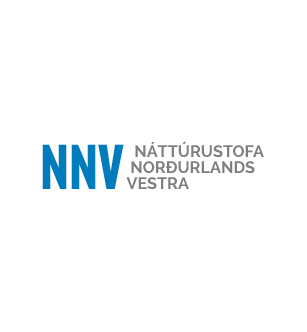
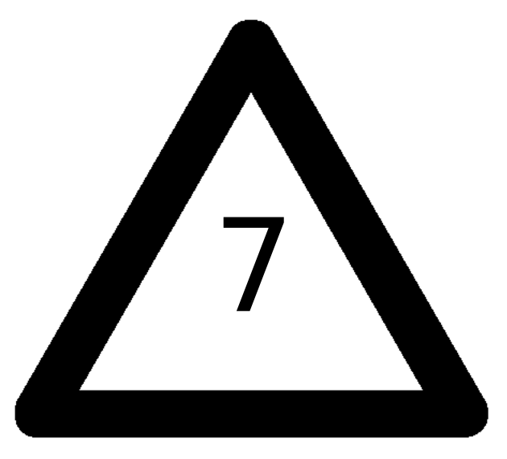
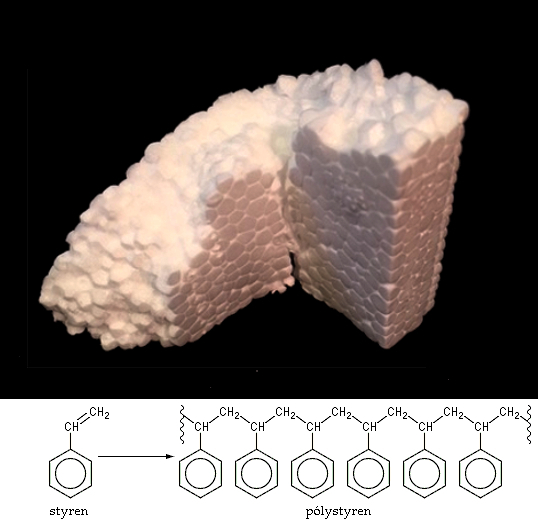
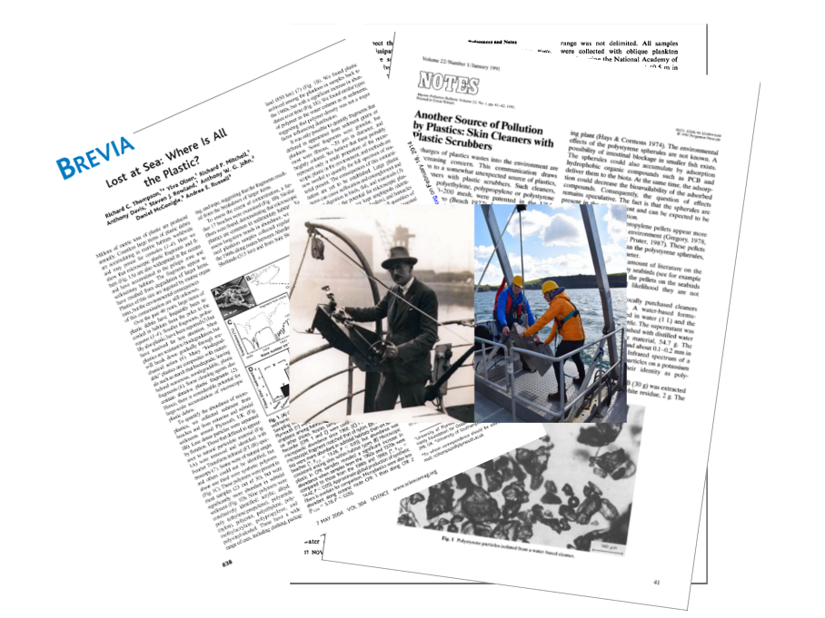
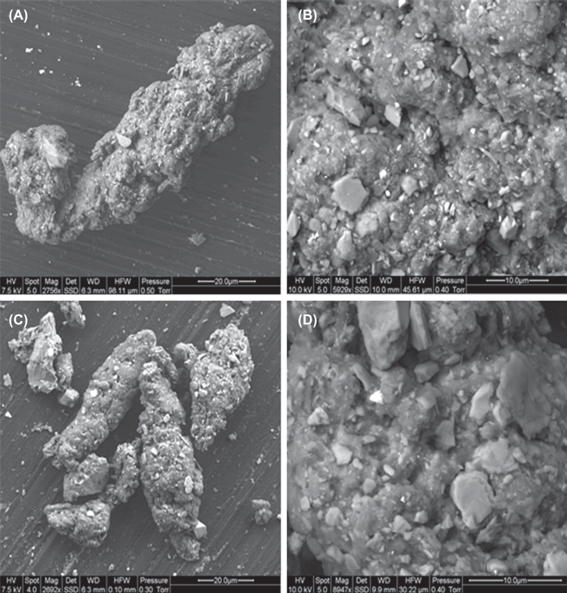
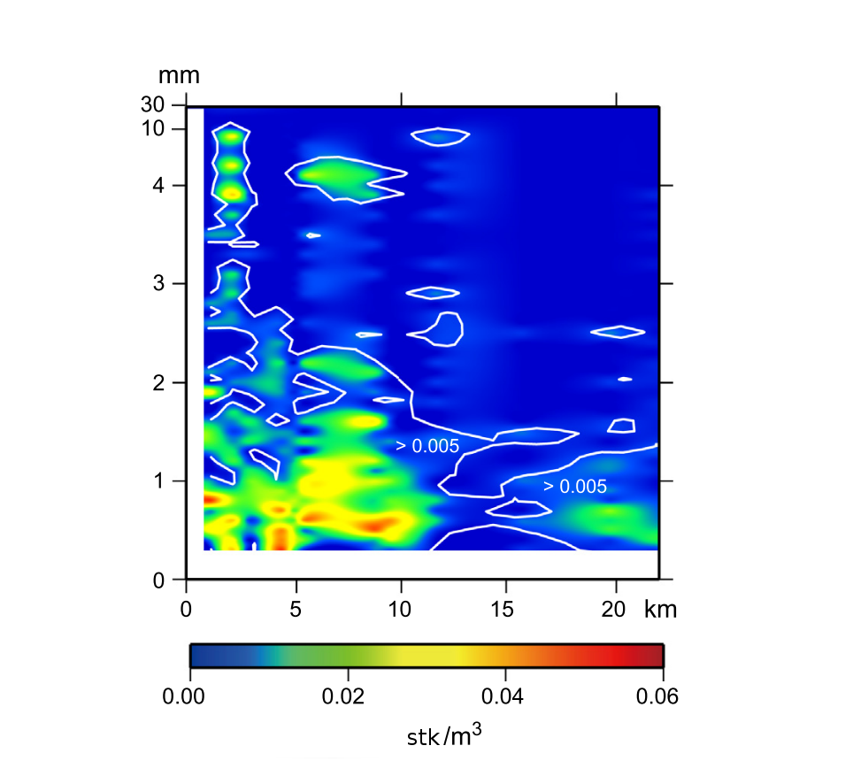
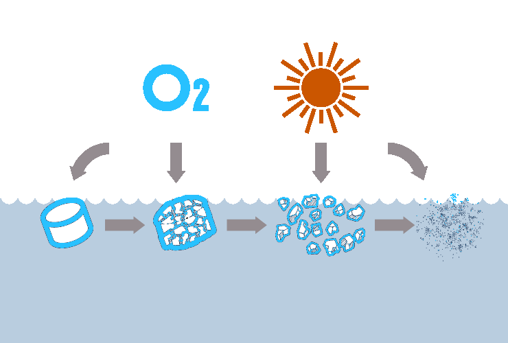
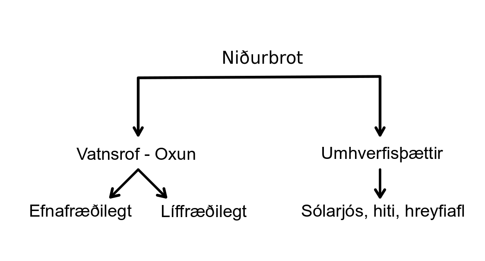
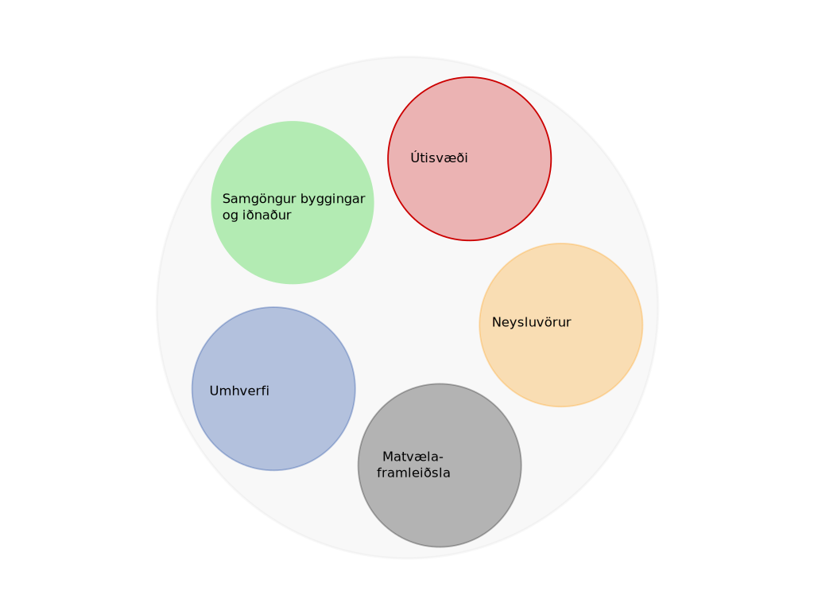

---
#Sys.setlocale("LC_TIME", "Icelandic")
title: "Örplast í hafinu við Ísland"
subtitle: "Helstu uppsprettur, magn og farvegir í umhverfinu"
author:   |
  <span class="noem">Valtýr Sigurðsson</span>
  <br><br>
  
  
date: "`r format(Sys.time(), '%e. %B %Y')`"
lang: is
output:
  xaringan::moon_reader:
    lib_dir: libs
    css: 
      - default
      - default-fonts
      - duke-blue
      - hygge-duke
      - libs/cc-fonts.css
      - libs/figure-captions.css
    nature:
      highlightStyle: github
      highlightLines: true
      countIncrementalSlides: false
---


class: center
# Hvað er plast?
```{r echo=FALSE, message=FALSE, warning=FALSE, out.width='90%'}
knitr::include_graphics("myndir/bakelite.png")
```
???
Plast er samofið öllum kimum samfélagsins. Það er órjúfanlegur þáttur í heilsukerfinu og það léttir faratæki í lofti, á landi og láði.
Spurning um að setja inn aðra svipaða slæðu með óþarfa plasti sem er til í svo miklu magni af því að það er svo ódýrt

Myndir:
málning: https://www.visindavefur.is/myndir/malning_380_120713.jpg
gervigras: https://media1.fdncms.com/pique/imager/u/zoom/3250826/news_whistler3-1-7285033a61845ebf.jpg
plastparket: https://www.recommend.my/blog/wp-content/uploads/2017/06/install-vinyl.jpg
Bárujárnsþak (ekki notað hér): https://www.visindavefur.is/myndir/barujarn_stor_180816.jpg
Þök í Rvk: https://scontent.frkv2-1.fna.fbcdn.net/v/t1.0-9/37335569_10156265971825042_1132775165936009216_n.jpg?_nc_cat=107&_nc_ht=scontent.frkv2-1.fna&oh=056dd75959e638b2da5c5f35b3dd7785&oe=5D691461
sjúkrahús: https://upload.wikimedia.org/wikipedia/commons/5/54/Dialysis_-_arm_-_01.jpg


---
class: center,middle
```{r framleidsla, echo=FALSE, message=FALSE, warning=FALSE,, out.width='80%'}
library(kableExtra)
haus <- c('Plastgerð','Skammstöfun (ensk)','Heimsframleiðsla', 'Plastkóði (RIC)')#,'Einliða resíns')

type = c(
  'Pólýetýlen terefþalat',
  'Pólýetýlen - eðlisþyngd > 0,94 g/cm^3^',
  'Pólývínyl klóríð',
  'Pólýetýlen - eðlisþyngd < 0,94 g/cm^3^',
  'Pólýprópýlen',
  'Pólýstýren',
  'Annað'
)

type.pdf = c(
  'Pólýetýlen terefþalat',
  'Pólýetýlen - há eðlisþyngd',
  'Pólývínyl klóríð',
  'Pólýetýlen - lág eðlisþyngd',
  'Pólýprópýlen',
  'Pólýstýren',
  'Annað'
)

abbro= c(
  'PET, PETE',
  'HD-PE, PE-HD',
  'PVC',
  'LDPE, PE-LD',
  'PP',
  'PS',
  ''
)

total=c(
  '7%',
  '15%',
  '16%',
  '17%',
  '23%',
  '7%',
  '15%'
)
# icon=c(icon1="",
#        icon2="",
#        icon3="",
#        icon4="",
#        icon5="",
#        icon6="",
#        icon7="")


icon=c(icon1='</img>',
       icon2='</img>',
       icon3='</img>',
       icon4='</img>',
       icon5='</img>',
       icon6='</img>',
       icon7='</img>')

tafla = cbind(type.pdf, abbro, total, icon)
dimnames(tafla)[2] <- list(haus)
rownames(tafla) <- NULL
tafla <- as.data.frame(tafla)

#DT::datatable(tafla, escape = FALSE)
 
 knitr::kable(
   tafla,
   align = 'c',
   booktabs = T,
   escape = F,
   caption = 'Alþjóðlegt flokkunarkerfi (RIC) fyrir algengustu plastefnin.',
   "html"
   )# eru númeraðar eftir alþjóðlegu flokkunarkerfi (RIC). Skammstafanirnar eru fyrir ensku heitin: (1) Polyethylene Terephthalate - PETE/PET, (2) High Density Polyethylene - HDPE/HD-PE, (3) Polyvinyl Chloride - PVC/V, (4) Low Density Polyethylene - LDPE/LD-PE, (5) Polypropylene - PP, (6) Polystyrene - PS')
  
```

???
Algengustu plastefnin eru flokkuð í 6 algengustu gerðir plasts en allt annað plast lendir í 7 flokknum. Í þeim flokki eru allskonar samsett plast líkt og notað er í báta, filmur, lakk og pólýúretön, blöðrur og hjólbarðar.

---
class: center, inverse
# Hvað er plast?
## Myndun fyrsta plastefnisins „Bakelite“
```{r echo=FALSE, message=FALSE, warning=FALSE, out.width='100%'}
knitr::include_graphics("https://thumbs.gfycat.com/BaggyWarlikeAmericancrow-size_restricted.gif")
```


???
Fyrsta plastefnið, Bakelite, var fundið upp um aldamótin 1900
Fenól og formaldehýð hitað og hrært saman við brennisteinssýru til að mynda fenólformaldehýðresín sem er fyrsta plastefnið eða plastresínið.

---

class: center
# Hvað er plast?
.pull-left[
```{r echo=FALSE, message=FALSE, warning=FALSE, out.width='100%'}

```
<br>
<br>

]
.pull-right[
```{r echo=FALSE, message=FALSE, warning=FALSE, out.width='100%'}
knitr::include_graphics("https://thumbs.gfycat.com/OldfashionedHarshBettong-size_restricted.gif")
```
]

Pólýstýren er myndað með fjölliðun á stýreni.

???
https://www.youtube.com/watch?v=BCNWav12PdI

---

class:center, middle, inverse
.Large[Hugtakið „microplastic“ sett fram 2004]
```{r echo=FALSE, message=FALSE, warning=FALSE, out.width='100%'}

```

???
Árið 2004 var hugtakið „microplastic“ sett fram (Thompson) í grein þar sem sýni úr sjávarseti voru skoðuð með litrófssjá og um 9 gerðir plasts fundust í þeim þ.á.m. úr fatnaði, pakkningum, reipum o.fl. Einnig voru þörungasýni ^[þörungasnið eru tekin úr efri lögum sjávar úti á opnu hafi sem og nærri ströndum] greind aftur í tímann til 1960 og í þeim sást skýrt að eftir því sem framleiðsla á plasti jókst fjölgaði plastögnum í hafinu.

Árið 1972 (Carpender ofl.) var tilkynnt um pólýstýren í hafi sem hefðu bakteríur á yfirborði sínu. Áður hafði fólk lengi tekið eftir því hve plast var slitþolið og entist lengi í umhverfinu og að það fyndist í maga fugla og annarra dýra.

Árið 1991 kom út grein (eftir V. Zitko) þar sem bent var á að í snyrtivörum væru smáar plastagnir sem bærust í hafið


---

```{r pubtrend, echo=FALSE, message=FALSE, warning=FALSE, dev.args=list(bg="transparent"), out.width='60%', fig.align='center'}

par(mar=c(4,4,4,2))

roundUpNice <- function(x, nice=c(1,2,4,5,6,8,10)) {
  if(length(x) != 1) stop("'x' must be of length 1")
  10^floor(log10(x)) * nice[[which(x <= 10^floor(log10(x)) * nice)[[1]]]]
} # https://stackoverflow.com/questions/6461209/how-to-round-up-to-the-nearest-10-or-100-or-x

pub.trend <- read.csv("skjol/PubTrend.txt",sep = "\t")
pub.trend <- pub.trend[,1:2]
pub.trend <- pub.trend[rev(rownames(pub.trend)),]
maxtala <- max(pub.trend[,2])
require(RColorBrewer)
litir <- colorRampPalette(c('#d75f07','seashell','#069acc'))(dim(pub.trend)[1])
litir <- rev(litir)
bp <- barplot(pub.trend[,2],ylab='',xlab='',axes=F,beside=TRUE,ylim=c(0,maxtala*1.1))
abline(h=seq(0,roundUpNice(1.1*maxtala),roundUpNice(1.1*maxtala)/5), col = 'lightgray', lty = 3)
barplot(pub.trend[,2], main='Fjöldi ritrýndra greina um örplast á ári', ylab="Fjöldi greina", beside=TRUE, axes = F, col=litir ,ylim = c(0,maxtala*1.1),add=T);box()
axis(2,seq(0,roundUpNice(1.1*maxtala),roundUpNice(1.1*maxtala)/5),labels = seq(0,roundUpNice(1.1*maxtala),roundUpNice(1.1*maxtala)/5),las=2)
axis(1,bp,pub.trend[,1])
```

.large[
Birtingar alþjóðlegra vísindagreina með örplast sem meginviðfangsefni á árunum 2008 til 2018. 
]

???
Fengið af vef [Web of Knowledge](https://webofknowledge.com).
---

background-image: url(myndir/samsett.png)
background-size: contain
background-position: right

class: left, middle

###Slit á hjólbörðum <br>
###Vegmerkingar<br>
###Plastframleiðsa <br>
###Fatnaður<br>
###Rusl  <br>
###Snyrtivörur


???
Örplast kemur aðallega frá stærra plasti sem veðrast og slitnar við notkun.
Dekk, vegmerkingar, hráplast (e. nurdles),örplast í sýni frá BioPol, reipi, íslensk framleiðsla á kari úr plasti, syntetískur fatnaður, plastpokar, snyrtivörur.

http://mediad.publicbroadcasting.net/p/wemu/files/201602/old_tires.jpg
https://i.ytimg.com/vi/gdZYkOFiROI/maxresdefault.jpg
https://keyassets-p2.timeincuk.net/wp/prod/wp-content/uploads/sites/57/2016/08/microbeads-landscape-620x492.jpg
http://my.essai-tools.com/uploads/20189174/car-plastic-parts-molding32583594420.jpg
https://za.toluna.com/dpolls_images/2018/09/20/34ca78d1-75be-4436-a5ae-4be1bccc2b78.jpg
http://www.svn.is/images/Gullverskar_%C3%A1_v%C3%AD%C3%B0avangi.jpg
https://biopol.is/files/frettamyndir/karin_microplast_fiskifr.jpg
https://upload.wikimedia.org/wikipedia/commons/f/f3/Plastic_pellets.jpg
http://www.keycolour.net/wp-content/uploads/2017/08/fabric-624x468.jpg
https://cdn.textileschool.com/wp-content/uploads/2011/02/rope-1457381_1280.jpg
---

background-image: url(myndir/bakgrunnur.png)
class:middle
#Skilgreining örplasts
.content-box-red[.justify-center[
Plastagnir sem eru minni en **5 mm** í tveimur víddum <br> (lengd, hæð eða breidd)
]]
--
.pull-left[

### Frummyndað
.blue[Frummyndað örplast (*e. primary*)<br>
Berst út í umhverfið sem örplast
  - Affall úr skólpi og ræsum
  - Óhöpp við flutninga

]]

.pull-right[
### Síðmyndað

.orange[Síðmyndað örplast (*e.secondary*) <br>
Verður til við sundrun plasts í náttúrunni
  - Plastrusl í fjörum
  - Annað rusl

]]

???


---
```{r include=FALSE}
options(htmltools.dir.version = FALSE)
```

# Helstu uppsprettur örplasts

```{r Sank, echo=FALSE, message=FALSE, warning=FALSE}

#losun <- (l+h)/2 #Meðaltal lægra og hærra mats á losun.
value <- c(379, 41, 18.2+11.8+3.2, 3, 8.2, 0.34) #Uppspretta lægra mat
losun <- c(164, 5.7, 12+3.2, 0.3, 8.2, 0.34) #losun lægra mat
#value <- c(379,586,38,233,21,48,3,11,8,32,0.3,3)
heiti <-c('Dekkjaslit','Vegmerkingar','Húsamálning','Gervigras','Þvottur','Snyrtivörur')
land <- value-losun
df <- data.frame(heiti,land,losun)
df <- df[order(df$heiti),]

library(networkD3)
nodes <- c(levels(df$heiti), 'Land ','Haf ')
nodes <- as.data.frame(nodes)
names(nodes) <- "name"

a <- list()
for (i in 1:nrow(df)) {
  a[i] <- list(rbind(matrix(c(df[i,c(2,3)]))))
}
b <- do.call(c,a)
value <- unlist(b)

links <- 
  data.frame(
    source=c(0,0,1,1,2,2,3,3,4,4,5,5),
    target=c(6,7,6,7,6,7,6,7,6,7,6,7),
    value=value)


Sank <- list(nodes, links)
names(Sank) <- c('nodes', 'links')
sn <- sankeyNetwork(
  Links = Sank$links,
  Nodes = Sank$nodes,
  Source = "source",
  Target = "target",
  Value = "value",
  NodeID = "name",
  units = "tonn",
  colourScale = JS("d3.scaleOrdinal(d3.schemeCategory20);"),
  fontSize = 28,
  nodeWidth = 30, width = "500px", height = "500px"
)
#sn
library(widgetframe)
rammi <- frameWidget(sn)
rammi

```


???

Stærsta uppspretta örplasts í umhverfinu á Íslandi, sem lagt var mat á, er tengd bifreiðaumferð. Slit á dekkjum og vegmerkingum er um 60-85% örplastslosunar á Íslandi

---
class:inverse,center
.Large[Dekkjaslit (dekkja- og vegaagnir)]
```{r echo=FALSE, message=FALSE, warning=FALSE, out.width='75%'}

```
???
Dekkjaagnirnar sem myndast við akstur blandast öðrum ögnum sem eru í malbikinu og vegrykinu sem breytir efnasamsetningu agnanna81. Þessi blanda dekkja- og vegslits (e. tyre and road wear particles - TRWP) getur því til viðbótar innihaldið efni á borð við bik, þ.e. úr malbiki101, og ryk frá bremsuborðum/diskum102. Í þessari skýrslu er litið á gúmmíblönduna, ásamt öðrum bætiefnum sem er er blandað saman í slitlagi hjólbarða, sem eina heild óháð fjölliðuinnihaldi.

---

.pull-left[
  ```{r echo=FALSE, message=FALSE, warning=FALSE, out.width='100%'}

```
]
.pull-right[
 ##Dekkjaslit

+ Gúmmísólar venjulegra bíldekkja eru gerðir úr blöndu af gervigúmmíi (aðallega stýren bútadíen gúmmí og ýmsum íblöndunarefnum)
{{content}}

]

--

+ Agnirnar eru á bilinu 10-100 µm (stærra en svifryk)
{{content}}

--

+ Berast með affallsvatni til sjávar
{{content}}

--

    + gegnum ræsi í þéttbýli
    + með ám og lækjum

--

+ Mest umferð í þéttbýli - hátt hlutfall dekkjaslits berst til hafs
--

+ Dreifbýli - hverfandi magn berst til hafs.
---
# Dekkjaslit

- Gúmmísólar venjulegra bíldekkja eru gerðir úr blöndu af gervigúmmíi (aðallega stýren bútadíen gúmmí og ýmsum íblöndunarefnum)

--

- Agnir á bilinu 10-100 µm (stærra en svifryk)

--

- Agnir á bilinu 10-100 µm (stærra en svifryk)

???
Hlutfall plastfjölliða í slitlagi hjólbarða er á bilinu 40-60%
---

---
```{r akstur, echo=FALSE, cache = TRUE}
library(RColorBrewer)
options(OutDec = ",")
# Heildarþyngd ökutækis: Þyngd ökutækis eða vagnlestar með ökumanni, farþegum, farmi og viðfestum vinnutækjum.


bifreidar <- matrix(c(227409,23159,2410,8078,2049,2661,9746,17181,12601,14251.6,33693.6,17832,85,102,267,546,132,159,415,850),5,4,byrow = T)

slit_lagt <- bifreidar[1,]*bifreidar[3,]*bifreidar[4,]/1000000000 #Fjöldi*meðalakstur*(slit (mg/ári) lægri talan)
losun_lagt <- c()
  for (i in 1:length(slit_lagt)) {
  losun_lagt[i] <- (2/3)*slit_lagt[i]*0.6+(1/3)*slit_lagt[i]*0 #Verschoor2016
}
slit_lagt <- round(slit_lagt,0)
losun_lagt <- round(losun_lagt,0)

slit_hatt <- bifreidar[1,]*bifreidar[3,]*bifreidar[5,]/1000000000 #Fjöldi*meðalakstur*(slit (mg/ári) hærri talan)
losun_hatt <- c()
for (i in 1:length(slit_hatt)) {
  losun_hatt[i] <- (2/3)*slit_hatt[i]*0.6+(1/3)*slit_hatt[i]*0 #Verschoor2016
}
slit_hatt <- round(slit_hatt,0)
losun_hatt <- round(losun_hatt,0)

slit_ari <- ifelse(slit_hatt>slit_lagt,paste(slit_lagt,slit_hatt,sep = "-"),paste(slit_hatt,slit_lagt,sep = "-"))
losun_ari <- ifelse(losun_hatt>losun_lagt,paste(losun_lagt,losun_hatt,sep = "-"),paste(losun_hatt,losun_lagt,sep = "-"))

bifreidar[2,] <- round(bifreidar[2,]/1000,2)
bifreidar[3,] <- round(bifreidar[3,]/1000,2)
bifreidar <- rbind(bifreidar[1:3,],paste(bifreidar[4,],bifreidar[5,],sep="-"),slit_ari,losun_ari)

colnames(bifreidar) <- c('Fólksbifreið','Sendibifreið','Hópbifreið','Vörubifreið')
rownames(bifreidar)<- c("Fjöldi","Meðalþyngd (t)","Meðalakstur (þús. km/ár)","Slit (mg/km)", "Slit (t/ár)", "Losun í hafið (t/ár)")


#bifreidar <- rbind(icon[c(1,2,3,4)],bifreidar)
bifreidar <- format(bifreidar,  decimal.mark=",", big.mark=".", scientific=FALSE)
knitr::kable(bifreidar, booktabs=T)
#if (knitr::is_html_output()) {
   # knitr::kable(bifreidar, booktabs=T, caption = "Áætluð árleg losun örplasts í hafið vegna slits á hjólbörðum bifreiða. Fjöldi bíla af mismunandi gerðum í umferð á Íslandi þann 14. ágúst 2018 og meðalakstur skv. Umferðastofu. Með meðalþyngd er átt við heildarþyngd [skv. reglugerð](https://www.reglugerd.is/reglugerdir/allar/nr/155-2007). Byggt á mati Klein (2017) [-@klein2017methods] og Verschoor (2016) [-@Verschoor2016].")

#} 
```


---

```{r include=FALSE}
options(htmltools.dir.version = FALSE)
```


```{r  echo=FALSE, message=FALSE, warning=FALSE}

slit=c(244,34,22,79) 
losun=c(106,15,9,34)
land=slit-losun

library(networkD3)
A <- c("Fólksbifreiðar ","Sendibifreiðar ","Hópbifreiðar ","Vörubifreiðar ","Land ","Haf ")
nodes <- as.data.frame(A)
names(nodes) <- "name"
#nodes$name <-  as.character(nodes$name)
links <- data.frame(source=rep(0:3,2),target=rep(4:5, each=4),value=c(land,losun))

Sank <- list(nodes, links)
names(Sank) <- c('nodes', 'links')
sn <- sankeyNetwork(
  Links = Sank$links,
  Nodes = Sank$nodes,
  Source = "source",
  Target = "target",
  Value = "value",
  NodeID = "name",
  units = "tonn",
  colourScale = JS("d3.scaleOrdinal(d3.schemeCategory20);"),
  fontSize = 28,
  nodeWidth = 30, width = "500px", height = "500px"
)
#sn
library(widgetframe)
rammi <- frameWidget(sn)
rammi

```


???
Dekkjaslit
---

class:center, middle
.Large[Örplast á reki í hafinu]
```{r echo=FALSE, message=FALSE, warning=FALSE, out.width='80%'}

```
 
???
Þéttleiki smárra plastagna á reki í hafinu. Lárétti ásinn stendur fyrir fjarlægð frá landi og lóðrétti ásinn stærð plastagnanna sem fengust í háf við yfirborðið. Litaskalinn táknar þéttleika agnanna. Þéttleiki yfir 0,005 stk/m~3~ er innan línanna á myndinni (Isobe, 2014).

---


class: center, middle
.Large[Hugtakið „microplastic“ sett fram 2004]
```{r echo=FALSE, message=FALSE, warning=FALSE, out.width='100%'}

```

---


class: center, middle
.Large[Veðrun plasts í umhverfinu]
```{r echo=FALSE, message=FALSE, warning=FALSE, out.width='100%'}

```

???
Veðrun vegna ólífrænna þátta er aðalatriðið en þó mjög hægfara.
Gerist í efri lögum þar sem sólarljós nær til plastsins.
Er nánast engin í hafdjúpunum og á djúpsjávarbotni.
---
class: center, middle
.Large[Einkennandi farvegir fyrir mismunandi uppsprettur örplasts]
```{r fartafla, fig.cap='*Vegryk á við um hjólbarða og vegmerkingar', echo=FALSE, message=FALSE, warning=FALSE, out.width='60%'}
library(knitr)
library(kableExtra)

collapse_rows_dt <-
  data.frame(
    A = c(rep('Rennandi vatn', 11),'Andrúmsloft',rep('Hafið', 3),rep('Annað', 3)),
    B = c(rep('Fráveita: skólp og ofanvatn', 8),rep('Ár, lækir og skurðir',3),'Vindur',rep('Hafstraumar/sjávarföll', 3),'Sigvatn','Landgræðsla','Snjómokstur'),
    C = c(c('Fatnaður','Snyrtivörur','Plastframleiðsla','Gervigrasvellir','Leiksvæði','Skósólar'),
        c('Vegryk*','Málning','Heyrúlluplast','Haglaskot','Plastrusl'),
          'Vegryk*',
        c('Veiðarfæri', 'Búnaður í sjókvíaeldi', 'Plastrusl í hafinu'),
        'Örplast frá urðunarstöðum',
        'Áburður úr seyru',
        'Vegryk*'))

colnames(collapse_rows_dt) <- c('Gerð farvegs', 'Farvegur', 'Uppsprettur í farvegi')


kable(collapse_rows_dt, align = "c") %>%
  kable_styling("striped",full_width = T, font_size = 12) %>%
  column_spec(1, bold = T) %>%
  collapse_rows(columns = 1:2, valign = "middle")


```

---

class: center, middle
.Large[Fjögur megin vatnasvæði Íslands]
```{r vatnasvidsv, fig.cap='Fjögur megin vatnasvæði Íslands. Skálínurnar liggja yfir vatnasvæði nr. 104 á suðvesturhorni landsins', out.width='100%', fig.align='center', echo=FALSE}
knitr::include_graphics("myndir/map.png")
```

---
class: center, middle
.Large[Helstu uppsprettur örplasts í umhverfið]
```{r echo=FALSE, message=FALSE, warning=FALSE, out.width='100%'}

```
---

background-image: url(myndir/uppsam.svg)

---
class: center, middle

```{r message=FALSE, warning=FALSE, include=FALSE}
library(BiocStyle)
```

```{r skolp, echo=FALSE, fig.align='center', message=FALSE, warning=FALSE, dev=switch(output(), html = "svg", latex = "pdf"), dev.args=list(bg="transparent"), out.width='60%', fig.cap="Tegund skólphreinsunar skipt eftir fjórum flokkum náttúrulegra yfirborðsvatnshlota. Unnið upp úr samantekt á stöðu skólpmála á Íslandi árið 2014 (Umhverfisstofnun, 2017)." }

par(mar=c(4,4,4,2))

roundUpNice <- function(x, nice=c(1,2,4,5,6,8,10)) {
  if(length(x) != 1) stop("'x' must be of length 1")
  10^floor(log10(x)) * nice[[which(x <= 10^floor(log10(x)) * nice)[[1]]]]
} # https://stackoverflow.com/questions/6461209/how-to-round-up-to-the-nearest-10-or-100-or-x

skólptölur <- read.csv("skjol/skolp_urban.csv", sep="\t",encoding = "UTF-8")
skólptölur <- skólptölur[!is.na(skólptölur$Magn.skólps..pe..)& skólptölur$Magn.skólps..pe..>0,]
levels(skólptölur$Tegund.hreinsunar) <- c("Eins þreps","Ekki vitað","Engin","Ítarleg","Ítarleg","Ítarleg","Rotþrær","Tveggja þrepa","Tveggja þrepa") #Hreinsa gögnin
require(plyr)
svaedi <- ddply(skólptölur,.(Svæði,Tegund.hreinsunar),summarise,Magn=sum(Magn.skólps..pe..),.drop=F)
skólp_fylki <- matrix(svaedi$Magn,nrow = length(levels(as.factor(svaedi$Tegund.hreinsunar))),ncol = length(unique(svaedi$Svæði)),dimnames=list(levels(as.factor(svaedi$Tegund.hreinsunar)),levels(svaedi$Svæði)))

landshlutar <- c('(NV)','(NA)','(SA)','(SV)')
colnames(skólp_fylki) <- paste(unique(svaedi$Svæði),landshlutar,sep="\n")

litir <- c('#7ECEF0','white','#CB5600', '#7F7CAF','#28587B','seashell')
bp <- barplot(skólp_fylki,ylab='',xlab='',axes=F,beside=TRUE,ylim=c(0,max(skólp_fylki)*1.1))
abline(h=seq(0,roundUpNice(1.1*max(skólp_fylki)),roundUpNice(1.1*max(skólp_fylki))/5), col = 'lightgray', lty = 3)
barplot(skólp_fylki, main='Tegund skólphreinsunar', ylab="Magn (þúsundir pe.)", beside=TRUE, axes = F, col=litir ,ylim = c(0,max(skólp_fylki)*1.1),add=T);box()
axis(2,seq(0,roundUpNice(1.1*max(skólp_fylki)),roundUpNice(1.1*max(skólp_fylki))/5),labels = seq(0,roundUpNice(1.1*max(skólp_fylki))/1000,roundUpNice(1.1*max(skólp_fylki))/5000),las=2)
legend('topleft', levels(as.factor(svaedi$Tegund.hreinsunar)), fill=litir)
```

???
Tegund skólphreinsunar skipt eftir fjórum flokkum náttúrulegra yfirborðsvatnshlota. Unnið upp úr samantekt á stöðu skólpmála á Íslandi árið 2014 [@Umhverfisstofnun2017].
---
```{r include=FALSE}
options(htmltools.dir.version = FALSE)
```

```{r out.width='100%', fig.height=6, fig.width=10, eval=require('networkD3'), echo=FALSE}

slit=c(244,34,22,79) 
losun=c(106,15,9,34)
land=slit-losun


A <- c("Fólksbifreiðar ","Sendibifreiðar ","Hópbifreiðar ","Vörubifreiðar ","Land ","Haf ")
nodes <- as.data.frame(A)
names(nodes) <- "name"
#nodes$name <-  as.character(nodes$name)
links <- data.frame(source=rep(0:3,2),target=rep(4:5, each=4),value=c(land,losun))
rass <- list(nodes,links)
names(rass) <- c('nodes','links')
sn <- sankeyNetwork(Links = rass$links, Nodes = rass$nodes, Source = "source",
                    Target = "target", Value = "value", NodeID = "name",
                    units = "tonn", fontSize = 24, nodeWidth = 30, iterations = 0, width = "500px", height = "500px")

rammi <- widgetframe::frameWidget(sn)
rammi
```


---
# Helstu uppsprettur örplasts2
```{r include=FALSE}
options(htmltools.dir.version = FALSE)
```

```{r SankB, echo=FALSE, message=FALSE, warning=FALSE}

slit=c(244,34,22,79) 
losun=c(106,15,9,34)
land=slit-losun

library(networkD3)
A <- c("Fólksbifreiðar ","Sendibifreiðar ","Hópbifreiðar ","Vörubifreiðar ","Land ","Haf ")
nodes <- as.data.frame(A)
names(nodes) <- "name"
#nodes$name <-  as.character(nodes$name)
links <- data.frame(source=rep(0:3,2),target=rep(4:5, each=4),value=c(land,losun))
rass <- list(nodes,links)
names(rass) <- c('nodes','links')
sn2 <- sankeyNetwork(Links = rass$links, Nodes = rass$nodes, Source = "source",
                    Target = "target", Value = "value", NodeID = "name",
                    units = "tonn", fontSize = 24, nodeWidth = 30, iterations = 0, width = "500px", height = "500px")

sn


```

???
Plís

---
#Skólp
class:middle
.pull-left[
```{r umferdvisitala1, echo=FALSE, fig.align="center", fig.cap="Vísitala umferðar (línur) ásamt meðalumferðarþunga yfir árið (stöplar) í þremur völdum sniðum innan höfuðborgarsvæðisins og á 16 lykilteljurum á hringveginum.", message=FALSE, warning=FALSE, dev=switch(output(), html = "svg", latex = "pdf"), dev.args=list(bg="transparent"), out.width='100%' }

roundUpNice <- function(x, nice=c(1,2,4,5,6,8,10)) {
  if(length(x) != 1) stop("'x' must be of length 1")
  10^floor(log10(x)) * nice[[which(x <= 10^floor(log10(x)) * nice)[[1]]]]
} # https://stackoverflow.com/questions/6461209/how-to-round-up-to-the-nearest-10-or-100-or-x


litura="#cb5600"
liturb="#0698d3"

rvk <- c(134529,140215,150318,162347,166900)
lndsb <- c(59959,63580,72650,79920,83575)
nicebil <- seq(0,roundUpNice(max(rvk)),roundUpNice(max(rvk))/8)
xas <- seq(2005,2018,1)
rass <- matrix(data = c(0,0,0,0,0,0,0,0,0,rvk,0,0,0,0,0,0,0,0,0,lndsb),nrow = 2,byrow = T,dimnames = list(c("Rvk","Lndsb"),xas))


par(mar = c(5,5,2,5))
bp <- barplot(1.5:14.5,rass+10000, col = NA, border = NA,axes = F)
par(new=TRUE)
barplot(rass,beside = T,axes = F,col = c(liturb,litura), border = NA, axisnames = F, ylim = c(0, max(rvk) * 1.1))
axis(4,nicebil,labels = nicebil/1000,las=2)
mtext("Meðalumferð á dag yfir árið",side=4,line = 3)
par(new=TRUE)

hofb <- c(100.00,103.90,113.31,114.30,111.61,110.06,107.63,109.18,112.26,115.61,120.50,129.18,139.52,143.55)
hring <- c(100.00, 105.86, 113.00, 110.85, 111.71, 109.12, 103.36, 103.05, 106.58, 112.34, 118.94, 135.91, 149.51, 155.93)

plot(xas,hring,type='n',font=2,ylab='Vísitala umferðar (árið 2005 = 100)',xlab='')
lines(xas,hring,type = 'o',col=litura,pch=16)
lines(xas,hofb,type = 'o',col=liturb,pch=17)

legend('topleft', c('Hringvegur','Höfuðborgarsvæðið'),lty = 'solid',col=c(litura,liturb),pch=c(16,17))

```
]
.pull-right[
  - blah
- bleh
]
---


---


