---
#Sys.setlocale("LC_TIME", "Icelandic")
title: "Örplast í hafinu við Ísland"
subtitle: "Helstu uppsprettur, magn og farvegir í umhverfinu"
author:   |
  <span class="noem">Valtýr Sigurðsson</span>
  <br><br>
  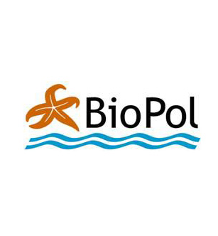
  
date: "`r format(Sys.time(), '%e. %B %Y')`"
lang: is
output:
  xaringan::moon_reader:
    lib_dir: libs
    css: 
      - default
      - default-fonts
      - duke-blue
      - hygge-duke
      - libs/cc-fonts.css
      - libs/figure-captions.css
    nature:
      highlightStyle: github
      highlightLines: true
      countIncrementalSlides: false
---
background-image: url(myndir/bakgrunnur.png)
class:middle


## Kynning á efni skýrslunnar:
### [„Örplast í hafinu við Ísland - Helstu uppsprettur, magn og farvegir í umhverfinu“](https://harkanatta.github.io/UAR-skyrsla/). 

Ýtið á „p“" til að sjá nótur og vísanir í myndir *sé kynningin á html-formi* en annars bendi ég á [vefsvæði kynningarinnar `r anicon::faa("github", animate="float")`](https://github.com/harkanatta/orplast2019)
???
Unnið með í R með [Xaringan](https://slides.yihui.name/xaringan/) eftir [Dukeslides](https://github.com/libjohn/dukeslides) `r anicon::faa("leaf", animate="burst")`
---


class: center
# Hvað er plast?
```{r echo=FALSE, message=FALSE, warning=FALSE, out.width='90%'}
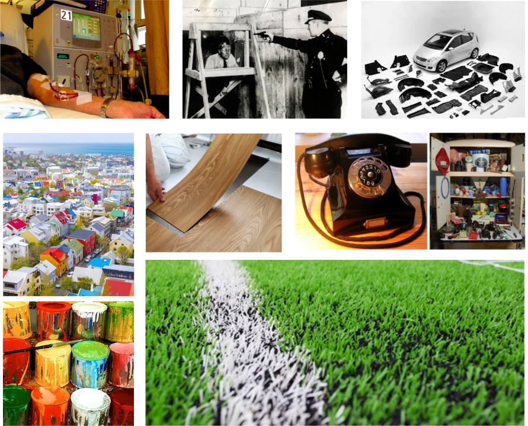
```
???
Plast er samofið öllum kimum samfélagsins. Það er órjúfanlegur þáttur í heilsukerfinu og það léttir faratæki í lofti, á landi og láði.
Spurning um að setja inn aðra svipaða slæðu með óþarfa plasti sem er til í svo miklu magni af því að það er svo ódýrt

Myndir:
málning: https://www.visindavefur.is/myndir/malning_380_120713.jpg
gervigras: https://media1.fdncms.com/pique/imager/u/zoom/3250826/news_whistler3-1-7285033a61845ebf.jpg
plastparket: https://www.recommend.my/blog/wp-content/uploads/2017/06/install-vinyl.jpg
Bárujárnsþak (ekki notað hér): https://www.visindavefur.is/myndir/barujarn_stor_180816.jpg
Þök í Rvk: https://scontent.frkv2-1.fna.fbcdn.net/v/t1.0-9/37335569_10156265971825042_1132775165936009216_n.jpg?_nc_cat=107&_nc_ht=scontent.frkv2-1.fna&oh=056dd75959e638b2da5c5f35b3dd7785&oe=5D691461
sjúkrahús: https://upload.wikimedia.org/wikipedia/commons/5/54/Dialysis_-_arm_-_01.jpg


---
class: center, inverse
# Hvað er plast?
## Myndun fyrsta plastefnisins „Bakelite“
```{r echo=FALSE, message=FALSE, warning=FALSE, out.width='100%'}
knitr::include_graphics("https://thumbs.gfycat.com/BaggyWarlikeAmericancrow-size_restricted.gif")
```


???
Fyrsta plastefnið, Bakelite, var fundið upp um aldamótin 1900
Fenól og formaldehýð hitað og hrært saman við brennisteinssýru til að mynda fenólformaldehýðresín sem er fyrsta plastefnið eða plastresínið.

---

class: center
# Hvað er plast?
.pull-left[
```{r echo=FALSE, message=FALSE, warning=FALSE, out.width='100%'}

```
<br>
<br>

]
.pull-right[
```{r echo=FALSE, message=FALSE, warning=FALSE, out.width='100%'}
knitr::include_graphics("https://thumbs.gfycat.com/OldfashionedHarshBettong-size_restricted.gif")
```
]

Pólýstýren er myndað með fjölliðun á stýreni.

???
https://www.youtube.com/watch?v=BCNWav12PdI

---

class: center,middle
```{r framleidsla, echo=FALSE, message=FALSE, warning=FALSE,, out.width='80%'}
library(kableExtra)
haus <- c('Plastgerð','Skammstöfun (ensk)','Heimsframleiðsla', 'Plastkóði (RIC)')#,'Einliða resíns')

type = c(
  'Pólýetýlen terefþalat',
  'Pólýetýlen - eðlisþyngd > 0,94 g/cm^3^',
  'Pólývínyl klóríð',
  'Pólýetýlen - eðlisþyngd < 0,94 g/cm^3^',
  'Pólýprópýlen',
  'Pólýstýren',
  'Annað'
)

type.pdf = c(
  'Pólýetýlen terefþalat',
  'Pólýetýlen - há eðlisþyngd',
  'Pólývínyl klóríð',
  'Pólýetýlen - lág eðlisþyngd',
  'Pólýprópýlen',
  'Pólýstýren',
  'Annað'
)

abbro= c(
  'PET, PETE',
  'HD-PE, PE-HD',
  'PVC',
  'LDPE, PE-LD',
  'PP',
  'PS',
  ''
)

total=c(
  '7%',
  '15%',
  '16%',
  '17%',
  '23%',
  '7%',
  '15%'
)
# icon=c(icon1="",
#        icon2="",
#        icon3="",
#        icon4="",
#        icon5="",
#        icon6="",
#        icon7="")


icon=c(icon1='</img>',
       icon2='</img>',
       icon3='</img>',
       icon4='</img>',
       icon5='</img>',
       icon6='</img>',
       icon7='</img>')

tafla = cbind(type.pdf, abbro, total, icon)
dimnames(tafla)[2] <- list(haus)
rownames(tafla) <- NULL
tafla <- as.data.frame(tafla)

#DT::datatable(tafla, escape = FALSE)
 
 knitr::kable(
   tafla,
   align = 'c',
   booktabs = T,
   escape = F,
   caption = 'Alþjóðlegt flokkunarkerfi (RIC) fyrir algengustu plastefnin.',
   "html"
   )# eru númeraðar eftir alþjóðlegu flokkunarkerfi (RIC). Skammstafanirnar eru fyrir ensku heitin: (1) Polyethylene Terephthalate - PETE/PET, (2) High Density Polyethylene - HDPE/HD-PE, (3) Polyvinyl Chloride - PVC/V, (4) Low Density Polyethylene - LDPE/LD-PE, (5) Polypropylene - PP, (6) Polystyrene - PS')
  
```

???
Algengustu plastefnin eru flokkuð í 6 algengustu gerðir plasts en allt annað plast lendir í 7 flokknum. Í þeim flokki eru allskonar samsett plast líkt og notað er í báta, filmur, lakk og pólýúretön, blöðrur og hjólbarðar.
---

class:center, middle, inverse

#Hugtakið „microplastic“ sett fram 2004

<figure>
  
</figure>


???
Árið 2004 var hugtakið „microplastic“ sett fram (Thompson) í grein þar sem sýni úr sjávarseti voru skoðuð með litrófssjá og um 9 gerðir plasts fundust í þeim þ.á.m. úr fatnaði, pakkningum, reipum o.fl. Einnig voru þörungasýni ^[þörungasnið eru tekin úr efri lögum sjávar úti á opnu hafi sem og nærri ströndum] greind aftur í tímann til 1960 og í þeim sást skýrt að eftir því sem framleiðsla á plasti jókst fjölgaði plastögnum í hafinu.

Árið 1991 kom út grein (eftir V. Zitko) þar sem bent var á að í snyrtivörum væru smáar plastagnir sem bærust í hafið

Árið 1972 (Carpender ofl.) var tilkynnt um pólýstýren í hafi sem hefðu bakteríur á yfirborði sínu. Áður hafði fólk lengi tekið eftir því hve plast var slitþolið og entist lengi í umhverfinu og að það fyndist í maga fugla og annarra dýra.


---

```{r pubtrend, echo=FALSE, message=FALSE, warning=FALSE, dev.args=list(bg="transparent"), out.width='60%', fig.align='center'}

par(mar=c(4,4,4,2))

roundUpNice <- function(x, nice=c(1,2,4,5,6,8,10)) {
  if(length(x) != 1) stop("'x' must be of length 1")
  10^floor(log10(x)) * nice[[which(x <= 10^floor(log10(x)) * nice)[[1]]]]
} # https://stackoverflow.com/questions/6461209/how-to-round-up-to-the-nearest-10-or-100-or-x

pub.trend <- read.csv("skjol/PubTrend.txt",sep = "\t")
pub.trend <- pub.trend[,1:2]
pub.trend <- pub.trend[rev(rownames(pub.trend)),]
maxtala <- max(pub.trend[,2])
require(RColorBrewer)
litir <- colorRampPalette(c('#d75f07','seashell','#069acc'))(dim(pub.trend)[1])
litir <- rev(litir)
bp <- barplot(pub.trend[,2],ylab='',xlab='',axes=F,beside=TRUE,ylim=c(0,maxtala*1.1))
abline(h=seq(0,roundUpNice(1.1*maxtala),roundUpNice(1.1*maxtala)/5), col = 'lightgray', lty = 3)
barplot(pub.trend[,2], main='Fjöldi ritrýndra greina um örplast á ári', ylab="Fjöldi greina", beside=TRUE, axes = F, col=litir ,ylim = c(0,maxtala*1.1),add=T);box()
axis(2,seq(0,roundUpNice(1.1*maxtala),roundUpNice(1.1*maxtala)/5),labels = seq(0,roundUpNice(1.1*maxtala),roundUpNice(1.1*maxtala)/5),las=2)
axis(1,bp,pub.trend[,1])
```

.large[
Birtingar alþjóðlegra vísindagreina með örplast sem meginviðfangsefni á árunum 2008 til 2018. 
]

???
Fengið af vef [Web of Knowledge](https://webofknowledge.com).
---

background-image: url(myndir/samsett.png)
background-size: contain
background-position: right

class: left, middle

###Slit á hjólbörðum <br>
###Vegmerkingar<br>
###Málning<br>
###Plastframleiðsa <br>
###Fatnaður<br>
###Rusl  <br>
###Snyrtivörur


???
Örplast kemur aðallega frá stærra plasti sem veðrast og slitnar við notkun.
Dekk, vegmerkingar, hráplast (e. nurdles),örplast í sýni frá BioPol, reipi, íslensk framleiðsla á kari úr plasti, syntetískur fatnaður, plastpokar, snyrtivörur.

http://mediad.publicbroadcasting.net/p/wemu/files/201602/old_tires.jpg
https://i.ytimg.com/vi/gdZYkOFiROI/maxresdefault.jpg
https://keyassets-p2.timeincuk.net/wp/prod/wp-content/uploads/sites/57/2016/08/microbeads-landscape-620x492.jpg
http://my.essai-tools.com/uploads/20189174/car-plastic-parts-molding32583594420.jpg
https://za.toluna.com/dpolls_images/2018/09/20/34ca78d1-75be-4436-a5ae-4be1bccc2b78.jpg
http://www.svn.is/images/Gullverskar_%C3%A1_v%C3%AD%C3%B0avangi.jpg
https://biopol.is/files/frettamyndir/karin_microplast_fiskifr.jpg
https://upload.wikimedia.org/wikipedia/commons/f/f3/Plastic_pellets.jpg
http://www.keycolour.net/wp-content/uploads/2017/08/fabric-624x468.jpg
https://cdn.textileschool.com/wp-content/uploads/2011/02/rope-1457381_1280.jpg
---

background-image: url(myndir/bakgrunnur.png)
class:middle
#Skilgreining örplasts
.content-box-red[.justify-center[
Plastagnir sem eru minni en **5 mm** 
]]
--
.pull-left[

### Frummyndað
.blue[Frummyndað örplast (*e. primary*)<br>
Berst út í umhverfið sem örplast
  - Affall úr skólpi og ræsum
  - Óhöpp við flutninga

]]

.pull-right[
### Síðmyndað

.orange[Síðmyndað örplast (*e.secondary*) <br>
Verður til við sundrun plasts í náttúrunni
  - Plastrusl í fjörum
  - Annað rusl

]]

???
Skilgreiningar munu kvíslast þegar á líður og örplast raðast eftir stærð og gerð; þræðir, agnir kúlur ofl. ...Aukaatriði...?

---
class:center, middle
.Large[Örplast á reki í hafinu]
```{r echo=FALSE, message=FALSE, warning=FALSE, out.width='80%'}
knitr::include_graphics("myndir/DriftDensity_isobe2014.png")
```
 
???
Þéttleiki smárra plastagna á reki í hafinu. Lárétti ásinn stendur fyrir fjarlægð frá landi og lóðrétti ásinn stærð plastagnanna sem fengust í háf við yfirborðið. Litaskalinn táknar þéttleika agnanna. Þéttleiki yfir 0,005 stk/m~3~ er innan línanna á myndinni (Isobe, 2014).

---

class: center, middle
###Einkennandi farvegir fyrir örplast
```{r fartafla, fig.cap='*Vegryk á við um hjólbarða og vegmerkingar', echo=FALSE, message=FALSE, warning=FALSE, out.width='60%'}
library(knitr)
library(kableExtra)

collapse_rows_dt <-
  data.frame(
    A = c(rep('Rennandi vatn', 11),'Andrúmsloft',rep('Hafið', 3),rep('Annað', 3)),
    B = c(rep('Fráveita: skólp og ofanvatn', 8),rep('Ár, lækir og skurðir',3),'Vindur',rep('Hafstraumar/sjávarföll', 3),'Sigvatn','Landgræðsla','Snjómokstur'),
    C = c(c('Fatnaður','Snyrtivörur','Plastframleiðsla','Gervigrasvellir','Leiksvæði','Skósólar'),
        c('Vegryk*','Málning','Heyrúlluplast','Haglaskot','Plastrusl'),
          'Vegryk*',
        c('Veiðarfæri', 'Búnaður í sjókvíaeldi', 'Plastrusl í hafinu'),
        'Örplast frá urðunarstöðum',
        'Áburður úr seyru',
        'Vegryk*'))

colnames(collapse_rows_dt) <- c('Gerð farvegs', 'Farvegur', 'Uppsprettur í farvegi')


kable(collapse_rows_dt, align = "c") %>%
  kable_styling("striped",full_width = T, font_size = 12) %>%
  column_spec(1, bold = T) %>%
  collapse_rows(columns = 1:2, valign = "middle")


```

---

class: center, middle
### Vatnshlot og skólp
.pull-left[
```{r vatnasvidsv, out.width='100%', fig.align='center', echo=FALSE}
knitr::include_graphics("myndir/map.png")
```
]
.pull-right[
```{r skolp, echo=FALSE, fig.align='center', message=FALSE, warning=FALSE, dev.args=list(bg="transparent"), out.width='100%'}

par(mar=c(4,4,4,2))

roundUpNice <- function(x, nice=c(1,2,4,5,6,8,10)) {
  if(length(x) != 1) stop("'x' must be of length 1")
  10^floor(log10(x)) * nice[[which(x <= 10^floor(log10(x)) * nice)[[1]]]]
} # https://stackoverflow.com/questions/6461209/how-to-round-up-to-the-nearest-10-or-100-or-x

skólptölur <- read.csv("skjol/skolp_urban.csv", sep="\t",encoding = "UTF-8")
skólptölur <- skólptölur[!is.na(skólptölur$Magn.skólps..pe..)& skólptölur$Magn.skólps..pe..>0,]
levels(skólptölur$Tegund.hreinsunar) <- c("Eins þreps","Ekki vitað","Engin","Ítarleg","Ítarleg","Ítarleg","Rotþrær","Tveggja þrepa","Tveggja þrepa") #Hreinsa gögnin
require(plyr)
svaedi <- ddply(skólptölur,.(Svæði,Tegund.hreinsunar),summarise,Magn=sum(Magn.skólps..pe..),.drop=F)
skólp_fylki <- matrix(svaedi$Magn,nrow = length(levels(as.factor(svaedi$Tegund.hreinsunar))),ncol = length(unique(svaedi$Svæði)),dimnames=list(levels(as.factor(svaedi$Tegund.hreinsunar)),levels(svaedi$Svæði)))

landshlutar <- c('(NV)','(NA)','(SA)','(SV)')
colnames(skólp_fylki) <- paste(unique(svaedi$Svæði),landshlutar,sep="\n")

litir <- c('#7ECEF0','white','#CB5600', '#7F7CAF','#28587B','seashell')
bp <- barplot(skólp_fylki,ylab='',xlab='',axes=F,beside=TRUE,ylim=c(0,max(skólp_fylki)*1.1))
abline(h=seq(0,roundUpNice(1.1*max(skólp_fylki)),roundUpNice(1.1*max(skólp_fylki))/5), col = 'lightgray', lty = 3)
barplot(skólp_fylki, main='Tegund skólphreinsunar', ylab="Magn (þúsundir pe.)", beside=TRUE, axes = F, col=litir ,ylim = c(0,max(skólp_fylki)*1.1),add=T);box()
axis(2,seq(0,roundUpNice(1.1*max(skólp_fylki)),roundUpNice(1.1*max(skólp_fylki))/5),labels = seq(0,roundUpNice(1.1*max(skólp_fylki))/1000,roundUpNice(1.1*max(skólp_fylki))/5000),las=2)
legend('topleft', levels(as.factor(svaedi$Tegund.hreinsunar)), fill=litir)
```

]

???
Tegund skólphreinsunar skipt eftir fjórum flokkum náttúrulegra yfirborðsvatnshlota. Unnið upp úr samantekt á stöðu skólpmála á Íslandi árið 2014 [@Umhverfisstofnun2017].

Þegar losun örplasts á Íslandi er skoðuð er rétt að taka suðvestur horn landsins út fyrir sviga. Þar sem helsta farleið örplasts er með rennandi vatni er hér notast við skiptingu íslenska vatnaumdæmisins í fjögur meginvatnasvæði73. Á suðvesturhorni landsins er vatnasvæði sem rennur í Faxaflóa (sjá mynd 3.1). Á því svæði býr yfir 3/4 hlutar landsmanna3 og þar er summa árdagsumferðar rúmir 3/4 hlutar á landsvísu. Flatarmál bygginga þar er yfir 50% flatarmáls allra bygginga á landsvísu74 en flatarmál málaðra flata eflaust enn meiri vegna byggingarhæðar. Flestir landsmenn fara til Reykjavíkur reglulega til að sækja þjónustu sem þar er í boði, nær allar vöruflutningar eru um svæðið og nærri allt millilandaflug. Þrír stórir slippir af fjórum eru á Höfuðborgarsvæðinu og í Grindavík. Það er því rík ástæða til að skoða þetta svæði betur.

---
class: center, middle
### Ofanvatn

```{r  out.width='100%', fig.align='center', echo=FALSE}
knitr::include_graphics("myndir/ALTA.png")
```

???
Mynd birt með góðfúslegu leyfi Alta

---
```{r include=FALSE}
options(htmltools.dir.version = FALSE)
```

### Helstu uppsprettur örplasts á Íslandi

```{r Sank, echo=FALSE, message=FALSE, warning=FALSE}

#losun <- (l+h)/2 #Meðaltal lægra og hærra mats á losun.
value <- c(371, 41, 26, 33.2, 60, 3, 0.2, 8.2, 0.34, 1, 0.002) #Uppspretta lægra mat
losun <- c(164, 5.7,  0, 15.2, 3.2, 0.3, 0, 8.2, 0.34, 0, 0.002) #losun lægra mat
#value <- c(379,586,38,233,21,48,3,11,8,32,0.3,3)
heiti <- c('Bifreiðahjólbarðar',
          'Vegmerkingar',
          'Flugvélahjólbarðar',
          'Húsamálning',
          'Skipamálning',
          'Gervigras',
          'Leikvellir',
          'Þvottur',
          'Snyrtivörur',
          'Haglaskot',
          'Sigvatn')
land <- value-losun
df <- data.frame(heiti,land,losun)
df <- df[order(df$heiti),]

library(networkD3)
nodes <- c(levels(df$heiti), 'Land','Haf')
nodes <- as.data.frame(nodes)
names(nodes) <- "name"

a <- list()
for (i in 1:nrow(df)) {
  a[i] <- list(rbind(matrix(c(df[i,c(2,3)]))))
}
b <- do.call(c,a)
value <- unlist(b)

links <- 
  data.frame(
    source=c(0,0,1,1,2,2,3,3,4,4,5,5,6,6,7,7,8,8,9,9,10,10),
    target=c(rep(c(11,12),11)),
    value=value)


Sank <- list(nodes, links)
names(Sank) <- c('nodes', 'links')
sn <- sankeyNetwork(
  Links = Sank$links,
  Nodes = Sank$nodes,
  Source = "source",
  Target = "target",
  Value = "value",
  NodeID = "name",
  units = "tonn",
  colourScale = JS("d3.scaleOrdinal(d3.schemeCategory20);"),
  fontSize = 20,
  nodeWidth = 30, width = "500px", height = "500px", fontFamily = "Courier"
)
#sn
library(widgetframe)
rammi <- frameWidget(sn)
rammi

```


???

Stærsta uppspretta örplasts í umhverfinu á Íslandi, sem lagt var mat á, er tengd bifreiðaumferð. Slit á dekkjum og vegmerkingum er um 60-85% örplastslosunar á Íslandi. 
Næst þar á eftir kemur húsamálning
Skipamálning í stóru slippunum er stór uppspretta í mikilli nálægð við hafið (fer eftir vinnubrögðum við málun og ekki síst þrif hversu mikið lendir í hafinu)

---
class:inverse,center
background-image: url(myndir/dekkjaslit.png)
#Dekkjaslit

???
Dekkjaagnirnar sem myndast við akstur blandast öðrum ögnum sem eru í malbikinu og vegrykinu sem breytir efnasamsetningu agnanna. Þessi blanda dekkja- og vegslits (e. tyre and road wear particles - TRWP) getur því til viðbótar innihaldið efni á borð við bik, þ.e. úr malbiki, og ryk frá bremsuborðum/diskum. 

Í þessari skýrslu er litið á gúmmíblönduna, ásamt öðrum bætiefnum sem er er blandað saman í slitlagi hjólbarða, sem eina heild óháð fjölliðuinnihaldi.

---
## Dekkja- og vegaagnir
.pull-left[
  ```{r echo=FALSE, message=FALSE, warning=FALSE, out.width='100%'}
knitr::include_graphics("myndir/twp.png")
```
]
.pull-right[


+ Gúmmísólar bíldekkja eru gerðir úr blöndu af gervigúmmíi
{{content}}

]

???
Gúmmísólar bíldekkja eru gerðir úr blöndu af gervigúmmíi (aðallega stýren bútadíen gúmmí og ýmsum íblöndunarefnum)
--

+ Agnirnar eru á bilinu 10-100 µm (stærra en svifryk)
{{content}}

--

+ Berast með affallsvatni til sjávar:
{{content}}

--

    + gegnum ræsi í þéttbýli
    + með ám og lækjum

--

+ Mest umferð í þéttbýli - hátt hlutfall dekkjaslits berst til hafs
--

+ Dreifbýli - hverfandi magn berst til hafs.


---
class:middle
##Dekkjaslit 
```{r akstur, echo=FALSE, cache = TRUE}
library(RColorBrewer)
options(OutDec = ",")
# Heildarþyngd ökutækis: Þyngd ökutækis eða vagnlestar með ökumanni, farþegum, farmi og viðfestum vinnutækjum.


bifreidar <- matrix(c(227409,23159,2410,8078,2049,2661,9746,17181,12601,14251.6,33693.6,17832,85,102,267,546,132,159,415,850),5,4,byrow = T)

slit_lagt <- bifreidar[1,]*bifreidar[3,]*bifreidar[4,]/1000000000 #Fjöldi*meðalakstur*(slit (mg/ári) lægri talan)
losun_lagt <- c()
  for (i in 1:length(slit_lagt)) {
  losun_lagt[i] <- (2/3)*slit_lagt[i]*0.6+(1/3)*slit_lagt[i]*0 #Verschoor2016
}
slit_lagt <- round(slit_lagt,0)
losun_lagt <- round(losun_lagt,0)

slit_hatt <- bifreidar[1,]*bifreidar[3,]*bifreidar[5,]/1000000000 #Fjöldi*meðalakstur*(slit (mg/ári) hærri talan)
losun_hatt <- c()
for (i in 1:length(slit_hatt)) {
  losun_hatt[i] <- (2/3)*slit_hatt[i]*0.6+(1/3)*slit_hatt[i]*0 #Verschoor2016
}
slit_hatt <- round(slit_hatt,0)
losun_hatt <- round(losun_hatt,0)

slit_ari <- ifelse(slit_hatt>slit_lagt,paste(slit_lagt,slit_hatt,sep = "-"),paste(slit_hatt,slit_lagt,sep = "-"))
losun_ari <- ifelse(losun_hatt>losun_lagt,paste(losun_lagt,losun_hatt,sep = "-"),paste(losun_hatt,losun_lagt,sep = "-"))

bifreidar[2,] <- round(bifreidar[2,]/1000,2)
bifreidar[3,] <- round(bifreidar[3,]/1000,2)
bifreidar <- rbind(bifreidar[1:3,],paste(bifreidar[4,],bifreidar[5,],sep="-"),slit_ari,losun_ari)

colnames(bifreidar) <- c('Fólksbifreið','Sendibifreið','Hópbifreið','Vörubifreið')
rownames(bifreidar)<- c("Fjöldi","Meðalþyngd (t)","Meðalakstur (þús. km/ár)","Slit (mg/km)", "Slit (t/ár)", "Losun í hafið (t/ár)")


#bifreidar <- rbind(icon[c(1,2,3,4)],bifreidar)
bifreidar <- format(bifreidar,  decimal.mark=",", big.mark=".", scientific=FALSE)
knitr::kable(bifreidar, booktabs=T)
#if (knitr::is_html_output()) {
   # knitr::kable(bifreidar, booktabs=T, caption = "Áætluð árleg losun örplasts í hafið vegna slits á hjólbörðum bifreiða. Fjöldi bíla af mismunandi gerðum í umferð á Íslandi þann 14. ágúst 2018 og meðalakstur skv. Umferðastofu. Með meðalþyngd er átt við heildarþyngd [skv. reglugerð](https://www.reglugerd.is/reglugerdir/allar/nr/155-2007). Byggt á mati Klein (2017) [-@klein2017methods] og Verschoor (2016) [-@Verschoor2016].")

#} 
```
<br>
<br>
.content-box-red[.justify-center[
Áætluð heildarlosun örplasts í hafið frá sliti bifreiðahjólbarða á Íslandi ≈ .bolder[164-255] tonn.
]]

---

```{r include=FALSE}
options(htmltools.dir.version = FALSE)
```


```{r  echo=FALSE, message=FALSE, warning=FALSE, fig.cap="Skipting örplastlosunar eftir afdrifum í haf eða á land"}

slit=c(244,34,22,79) 
losun=c(106,15,9,34)
land=slit-losun

library(networkD3)
A <- c("Fólksbifreiðar ","Sendibifreiðar ","Hópbifreiðar ","Vörubifreiðar ","Land ","Haf ")
nodes <- as.data.frame(A)
names(nodes) <- "name"
#nodes$name <-  as.character(nodes$name)
links <- data.frame(source=rep(0:3,2),target=rep(4:5, each=4),value=c(land,losun))

Sank <- list(nodes, links)
names(Sank) <- c('nodes', 'links')
sn <- sankeyNetwork(
  Links = Sank$links,
  Nodes = Sank$nodes,
  Source = "source",
  Target = "target",
  Value = "value",
  NodeID = "name",
  units = "tonn",
  colourScale = JS("d3.scaleOrdinal(d3.schemeCategory20);"),
  fontSize = 28,
  nodeWidth = 30, width = "500px", height = "500px", fontFamily = "Courier"
)
#sn
library(widgetframe)
rammi <- frameWidget(sn)
rammi

```


???
Á þjóðvegum og sveitavegum fari 90% af affallsvatni vega í jarðveginn og 10% í yfirborðsvatn; skurði, ár og læki
Í þéttbýli hérlendis fari 40% af affallsvatni vega í jarðveginn en 60% í ræsi.
---
class:middle
background-image: url(myndir/flughjolb.png)
background-size: contain
#.content-box-red[.black[Hjólbarðar flugvéla]]
--


.content-box-red[
+ Talsvert slit við lendingu og flugtak (≈26-50 t)
{{content}}
]

???
Afvúlkaníserast líklega við hitann (sem auðveldar sundrun plastefnanna)
--


+ Allar flugbrautir á Keflavíkurflugvelli afvatnast út í jarðveginn í kring
{{content}}

--


+ Minni flugvellir ekki skoðaðir betur
{{content}}


---

class:inverse,center
background-image: url(myndir/maxresdefault.jpg)
.content-box-red[.justify-center[
#Vegmerkingar
]]


---

## Vegmerkingar
.pull-left[
  ```{r echo=FALSE, message=FALSE, warning=FALSE, out.width='100%'}
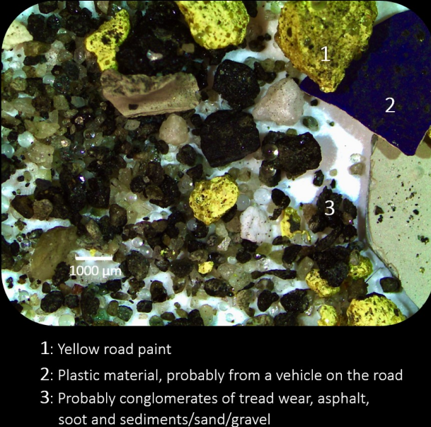
```
]
.pull-right[


+ 87% vegmerkinga Vegagerðarinnar vegna slits
{{content}}

]

???
Mikil endurnýjun. "nánast allar miðlínur endurnýjaðar árlega"
Mismunandi hlutfall plastefna (meira í málningu en mössun)
--


+ Berast með affallsvatni til sjávar:
{{content}}

--

    + gegnum ræsi í þéttbýli
    + með ám og lækjum

--

+ Mest umferð í þéttbýli - hátt hlutfall dekkjaslits berst til hafs


+ Dreifbýli - hverfandi magn berst til hafs.


---
class:middle
```{r vegmerkingar, echo=FALSE, message=FALSE, warning=FALSE}
linur <- data.frame(A=c('Stærri sveitarfélög','Minni sveitarfélög',rep('Vegagerðin',2)),
                    A2=c('Sprautuplast','Málning','Sprautuplast','Málning'),
                    B=c("254.280","84.170",'',''),
                    C=c("0,6","0,2",'',''),
                    D=rep('87%',4),
                    F=c(110,15,543,218),
                    G=c('1-25','15-40','1-25','15-40'),
                    H=c('1-28','2-6','5-135','33-87'),
                    I=c('0,6-16,8','1,3-3,6','0,5-13,5','3,3-8,7'))

haus <- c('','Gerð vegmerkinga', 'Íbúafjöldi', 'Notkun', 'Notkun v/viðhalds', 'Samtals vegmerkingar','Hlutfall fjölliða','Uppspretta v/slits','Losun í haf')
names(linur) <- c('','','','kg/mann','','Tonn','%','Tonn','Tonn')
require(dplyr)
require(knitr)
require(kableExtra)

#if (knitr::is_html_output()) {
  
kable(linur, caption = 'Áætluð árleg uppspretta örplasts frá vegmerkingum á Íslandi árið 2017.', align = "c") %>%
  kable_styling(full_width = T) %>%
  column_spec(1, bold = T) %>%
  add_header_above(haus) %>%
  collapse_rows(columns = 1:6, valign = "middle")%>%
  kable_styling(font_size = 14)

```
<br>
<br>
.content-box-red[.justify-center[
Losun örplasts í hafið frá vegmerkingum ≈ .bolder[5,7 - 42,6] tonn
]]

???
sjá mismunandi fjölliðuinnihald
Farvegir eru 
---


```{r include=FALSE}
options(htmltools.dir.version = FALSE)
```


```{r  echo=FALSE, message=FALSE, warning=FALSE, fig.cap="Skipting örplastlosunar frá vegmerkingum eftir notendum (stærri og minni sveitarfélög og Vegagerðin), gerð (sprautuplast/vegamálning) og afdrifum."}

nodes <- c('Stærri sveitarfélög ','Minni sveitarfélög ','Vegagerðin ','Sprautuplast ','Vegamálning ','Uppspretta (LM) ','Uppspretta (HM) ','Losun í haf (LM)','Losun í haf (HM)')
nodes <- as.data.frame(nodes)
names(nodes) <- "name"
#nodes$name <-  as.character(nodes$name)
links <- data.frame(source=c(0,1,2,2,3,4,3,4,5,6),target=c(3,4,3,4,5,5,6,6,7,8),value=c(110,15,543,218,6,35,163,93,5.7,42.6))

Sank <- list(nodes, links)
names(Sank) <- c('nodes', 'links')
sn <- sankeyNetwork(
  Links = Sank$links,
  Nodes = Sank$nodes,
  Source = "source",
  Target = "target",
  Value = "value",
  NodeID = "name",
  units = "tonn",
  colourScale = JS("d3.scaleOrdinal(d3.schemeCategory20);"),
  fontSize = 28,
  nodeWidth = 30, width = "500px", height = "500px", fontFamily = "Courier"
)
#sn
library(widgetframe)
rammi <- frameWidget(sn)
rammi

```


???

Miðað við útboðsgögn nokkurra stórra sveitarfélaga er notkun sprautuplasts um 0,6 kg á mann á ári í stærri þéttbýlum. Í minni þéttbýlum er algengt að notuð sé málning frekar en plast og í minna magni3. Þar er algengt að um 0,2 kg á mann sé notað af vegamálningu sé notuð árlega.
---

class:inverse,center
background-image: url(myndir/37335569_10156265971825042_1132775165936009216_n.jpg)
.content-box-red[.justify-center[
# Málning
]]


???
Innflutt málning árin 2016 og 2017 var 3.15 þúsund tonn á ári eða um 9,3 kg á mann (hér er ekki tekið með efni sem notuð eru til framleiðslu á málningu hérlendis). Þetta er af sömu stærðargráðu og mat Hann106 um málningarnotkun á mann í Evrópusambandsríkjunum (um 8,2 kg). Hér er átt við innflutta tilbúna málningu en innlend framleiðsla er undanskilin.
---

class:middle
## Utanhússmálning
.pull-left[
  ```{r echo=FALSE, message=FALSE, warning=FALSE, out.width='100%'}
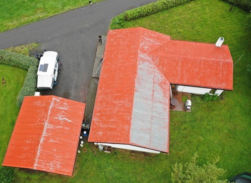
#[Mynd](https://www.google.com/search?q=m%C3%A1lu%C3%B0+%C3%BE%C3%B6k&rlz=1C1PRFI_enIS798IS798&sxsrf=ACYBGNSWLEUI-GLcfRxGAeJ-T8KN5b_4bw:1567755115475&source=lnms&tbm=isch&sa=X&ved=0ahUKEwi9soL21rvkAhUhShUIHVArCh8Q_AUIEigB&biw=1522&bih=738&dpr=1.25#imgrc=2M7d-lx1So8SzM:)
```
]
--

.pull-right[


+ Losun örplasts vegna:
{{content}}

]

--
    + háþrýstiþvotta og flögnunar
    + slits og veðrunar
{{content}}
--


+ Berst með affallsvatni til sjávar:
{{content}}

--

    + gegnum ræsi í þéttbýli
    + með ám og lækjum
{{content}}
--

+ Talsverð sundrun vegna sólarljóss

???
Líftími er langur og því er sundrun talin umtalsverð (67%)

[Mynd](https://www.google.com/search?q=m%C3%A1lu%C3%B0+%C3%BE%C3%B6k&rlz=1C1PRFI_enIS798IS798&sxsrf=ACYBGNSWLEUI-GLcfRxGAeJ-T8KN5b_4bw:1567755115475&source=lnms&tbm=isch&sa=X&ved=0ahUKEwi9soL21rvkAhUhShUIHVArCh8Q_AUIEigB&biw=1522&bih=738&dpr=1.25#imgrc=2M7d-lx1So8SzM:)
--

.footnote[.content-box-red[Áætluð losun örplasts í hafið frá utanhússmálningu ≈ .bolder[12-29] tonn.]]


---


class:inverse
background-image: url(myndir/burstathrif.png)
.content-box-red[.justify-right[
## Innimálning
]]
]

???
Aðeins við þrif á penslum
--

.pull-right[.content-box-red[


+ Þrif á penslum fer beina leið í sjóinn með fráveitu
{{content}}

]]


.footnote[.content-box-red[ Áætluð heildarlosun örplasts frá innimálningu á ári ≈ .bolder[3,2-7,1] tonn]]


???
[mynd](https://www.google.com/url?sa=i&source=images&cd=&ved=2ahUKEwjC-MfL37vkAhXkyYUKHdHUBMYQjRx6BAgBEAQ&url=https%3A%2F%2Fwww.youtube.com%2Fwatch%3Fv%3DiWJFcHl7PrA&psig=AOvVaw3l1ZV59vQXuOtrs_zsQZB7&ust=1567843829991092)

---
```{r echo=FALSE, fig.cap="Skipting örplastlosunar frá húsamálningu eftir afdrifum í haf eða á land", message=FALSE, warning=FALSE, fig.align='center'}
library(networkD3)
nodes <- c("Útimálning","Innimálning",'Land','Haf')
nodes <- as.data.frame(nodes)
names(nodes) <- "name"
#nodes$name <-  as.character(nodes$name)
links <- data.frame(source=c(0,0,1),target=c(2,3,3),value=c(30,12,3.2))
Sank <- list(nodes, links)
names(Sank) <- c('nodes', 'links')
sn <- sankeyNetwork(
  Links = Sank$links,
  Nodes = Sank$nodes,
  Source = "source",
  Target = "target",
  Value = "value",
  NodeID = "name",
  units = "tonn",
  colourScale = JS("d3.scaleOrdinal(d3.schemeCategory20);"),
  fontSize = 28,
  nodeWidth = 30, width = "500px", height = "500px", fontFamily = "Courier"
)
#sn
library(widgetframe)
rammi <- frameWidget(sn)
rammi
```

---

class:inverse,center
background-image: url(myndir/slippur.jpg)
.justify-left[
## Skipamálning]

???
Það eru Fjórir stórir slippir eru á landinu, þar af þrír á SV-landi og einn á Akureyri. Minni slippir, eða dráttarbrautir sem geta tekið inn smærri báta, eru hér og þar um landið

Mikill munur á mögulegri uppsprettu og losun í hafið var frá stærstu slippunum en að sögn starfsmanna nokkurra slippa er nánast allt hreinsað upp sem fellur til vegna viðhalds skipa
---
class:middle

```{r slippur, echo=FALSE, message=FALSE, warning=FALSE, fig.show='hold',out.width = '50%', dev.args=list(bg="transparent"),fig.cap='Samband skipslengdar og botnflatar. Kökuritið sýnir hlutfall botnflatar íslenskra fiskiskipa í þremur stærðarflokkum', fig.align='center' }
par(mar = c(4.6, 6, 0, 0))
Batar <- read.csv("skjol/batar.csv",fileEncoding = "UTF-8")
litlir <- Batar[Batar$Lengd<15,]
storir <- Batar[Batar$Lengd>30,]
adrir <- Batar[!rownames(Batar) %in% c(rownames(litlir),rownames(storir)),]
Batar$gerd <- ifelse(Batar$Lengd<15, "Smábátar",ifelse(Batar$Lengd>15 & Batar$Lengd<30,"Miðlungs","Stór skip"))

litura="#cb5600"
liturb="#28c1ff"

yLab=expression(paste("Botnflötur ( ",m^2,")"))
xLab="Lengd (m)"
plot(Batar$Lengd,(Batar$WSA),type='n', ylab = "",xlab="")
mtext(xLab,1,3,cex=2)
mtext(yLab,2,3,cex=2)
points(litlir$Lengd,(litlir$WSA),col=liturb, pch=18)
points(adrir$Lengd,(adrir$WSA),col=1)
points(storir$Lengd,(storir$WSA),col=litura, pch=19)
legend("topleft",c("Smábátar <15m. N=972","Miðlungs N=75","Stór skip >30m. N=99"),col = c(liturb,1,litura),pch = c(18,1,19),cex=2,bty='n')

# landi <- data.frame(
#   skr=c(2890,2889,2895,1868,2170,1902,2881,2882,2184),
#   L = c(54.75,54.75,54.75,56.86,64.55,55.6,80,81,66.96),
#   Breidd = c(13.5, 13.5, 13.5, 12.6, 12.8, 12.8, 17, 17, 13),
#   Brt= c(1827,1827,1827,1469.7,1845,1521,3672,3672,2160),
#   D = c(4.7, 4.7, 4.7, 7.7, 8, 8, 8.5, 8.5, 8.53)
# )
# 
# landi2 <- Batar[Batar$Skipaskrárnúmer %in% landi$skr,]
# points(landi2$Lengd,landi2$WSA,pch=13,cex=2,col=2) #Skip HBGranda

par(mar = c(0, 0, 0, 0))
require(plyr)
kaka <- ddply(Batar,.(gerd),summarise,Flatarmal=sum(WSA))
pie(kaka$Flatarmal,labels = kaka$gerd, border="grey",col = c("transparent",liturb,litura),cex=2,radius = 0.6)
```

???
Undir 15 metra löng skip, milli 15 og 30 metra löng og yfir 30 metra löng. Fengið með jöfnu frá Moser (2016).

---
class:middle
## Skipamálning (slippir)
.pull-left[
  ```{r echo=FALSE, message=FALSE, warning=FALSE, out.width='100%'}
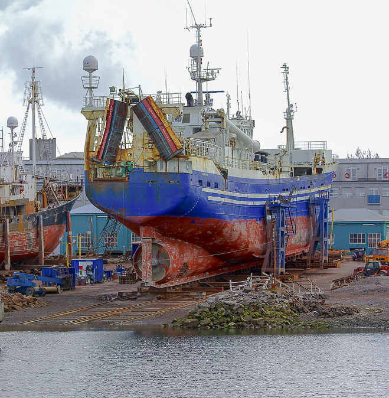
#[Mynd](https://www.google.com/url?sa=i&source=images&cd=&ved=2ahUKEwjQ86Wr4rvkAhUPyxoKHSGNCTwQjRx6BAgBEAQ&url=https%3A%2F%2Fhiveminer.com%2FTags%2Fhbgrandi%252Creykjav%25C3%25ADk&psig=AOvVaw3BAsWkHoyIGgn259DEBNeO&ust=1567844568638716)
```
]


???
[mynd](https://hiveminer.com/Tags/hbgrandi%2Creykjav%C3%ADk) 
--
.pull-right[


+ Líklega í um 100 stór skip í slipp árlega
{{content}}

]

--


+ örplastlosunin mögulega 0,6-2,6 tonn á skip (vegna háþrýstiþvottar og sprautunar á málningu undir berum himni)
{{content}}
+ Uppspretta ≈ 60 - 260 tonn/ári 
{{content}}
+ Losun í haf ≈ 3 tonn (miðað við óbein gögn, þarf að kanna aðstæður betur)
{{content}}

???
Starfsmenn slippanna segja að allt sé þrifið upp en segjast einnig bara geta talað fyrir sinn slipp
Ekkert er þrifið upp í minni brautum

---


class:middle
## Þvottur
.pull-left[
  ```{r echo=FALSE, message=FALSE, warning=FALSE, out.width='100%'}
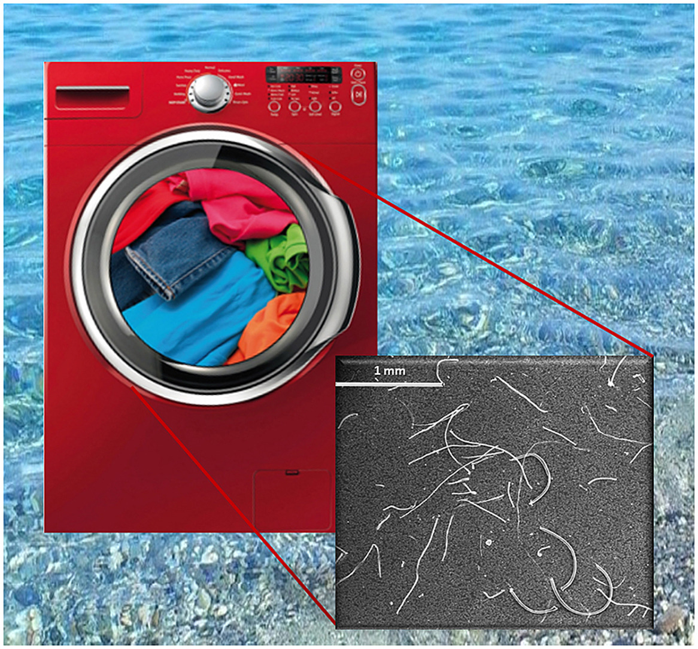
```
]
.pull-right[


+ Þræðir úr plastefnum t.d. pólýester
{{content}}

]


--

+ Berst  í skólp með niðurfalli þvottavéla 
{{content}}


--

+ Hlutfall gerviefna í þvotti	30-50% gerviefni (fer hækkandi)
{{content}}
--


+ Lítill hluti fer í seyru sem er nýtt í landbúnað eða urðuð
{{content}}


???
Fer eftir því hvort flíkur eru nýjar eða gamlar
---
class:middle
```{r echo=FALSE, message=FALSE, warning=FALSE}
"Fjöldi.þvotta.á.ári" = 165
"Fjöldi.heimila" = 120000
"þyngd.þvotta" = c(3,4) #3-4 kg
"þyngd.örplasts.fyrir.hvert.kg.gerviefna" = c(0.000012,0.00064) #12-640 mg
"Hlutfall.gerviefna.í.þvotti" = c(0.3,0.5) #30-50%

#Fjöldi.þvotta.á.ári*Fjöldi.heimila*þyngd.þvotta*þyngd.örplasts.fyrir.hvern.þvott*þyngd.örplasts.fyrir.hvert.kg.gerviefna

nafnalisti <- c("Fjöldi þvotta á ári",
                "Fjöldi heimila",
                "Þyngd þvotta",
                "Þyngd örplasts fyrir hvert kg gerviefna",
                "Hlutfall gerviefna í þvotti")

lina <- matrix(c("165","Þvottar","120.000","Heimili","3-4","kg","12-640","mg","30-50","% gerviefni"),ncol = 2,byrow = T,dimnames = list(nafnalisti,c("","Eining")))


kable(lina,align = "c", caption = 'Áætluð árleg losun örplasts frá þvotti í hafið á Íslandi.') %>% kable_styling(c("striped", "bordered", full_width = F, position = "center"))
  
```

<br>
<br>
.content-box-red[.justify-center[
Áætluð heildarlosun örplasts frá þvotti á Íslandi á ári ≈ .bold[8,2-32] tonn
]]

---
class:middle
## Framleiðsla (frumplast)
.pull-left[
  ```{r echo=FALSE, message=FALSE, warning=FALSE, out.width='100%'}
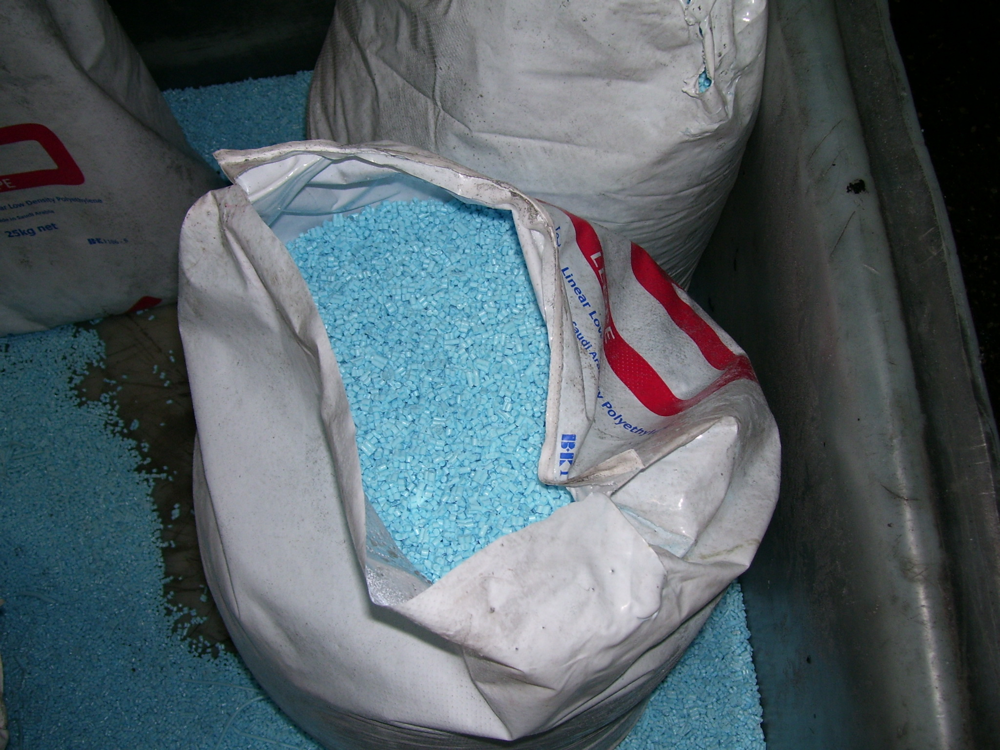
```
]

.pull-right[


+ Fiskikör, heitir pottar, trefjaplastbátar

+ Innflutt 12 tonn af frumplasti af ýmsum gerðum

+ Örplastlosun í haf:
    + Möguleg slys við flutninga
    + Litlu magni sópað í niðurföll


]

???
Upplausnir, þeytur og deig
---


class:middle
## Veiðarfæri
.pull-left[
  ```{r echo=FALSE, message=FALSE, warning=FALSE, out.width='100%'}
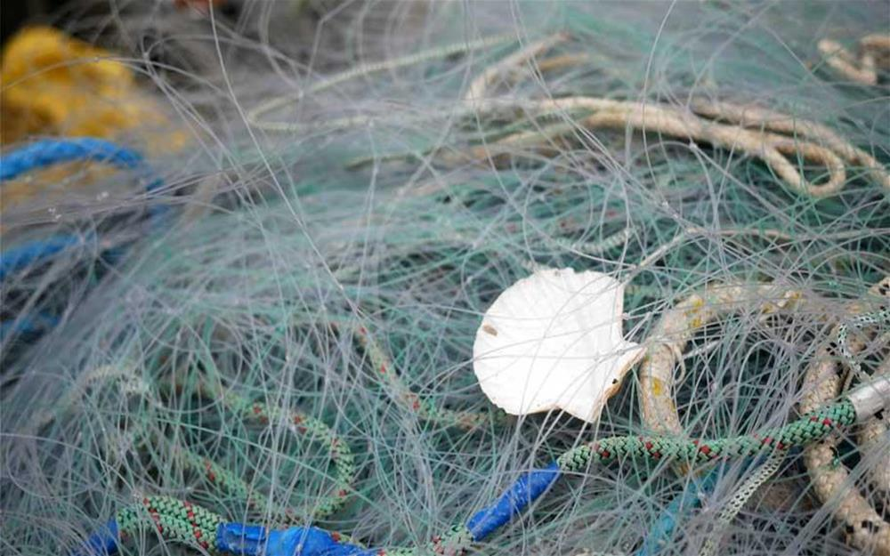
```
]
.pull-right[


+ Hátt í 7.000 tonn í umferð
{{content}}

]

???
Losun örplasts fer eftir því hvernig veiðarfæri um ræðir en sum þeirra slitna og missa þræði við notkun í mismiklum mæli. Aðrar gerðir veiðarfæra líkt og grásleppunet og handfæralínur slitna ekki með þeim hætti. Í sænskri rannsókn var losun örplasts metin 1-10% af heildarþyngd veiðarfæra
Minnast á sjókvíaeldi
--

+ 1.300 tonnum af veiðarfærum skilað til endurvinnslu/förgunar
{{content}}

--

+ Miðað við 0,5-1% slit við notkun er örplastlosun umtalsverð
{{content}}

---

class:middle
## Heyrúlluplast
.pull-left[
  ```{r echo=FALSE, message=FALSE, warning=FALSE, out.width='100%'}
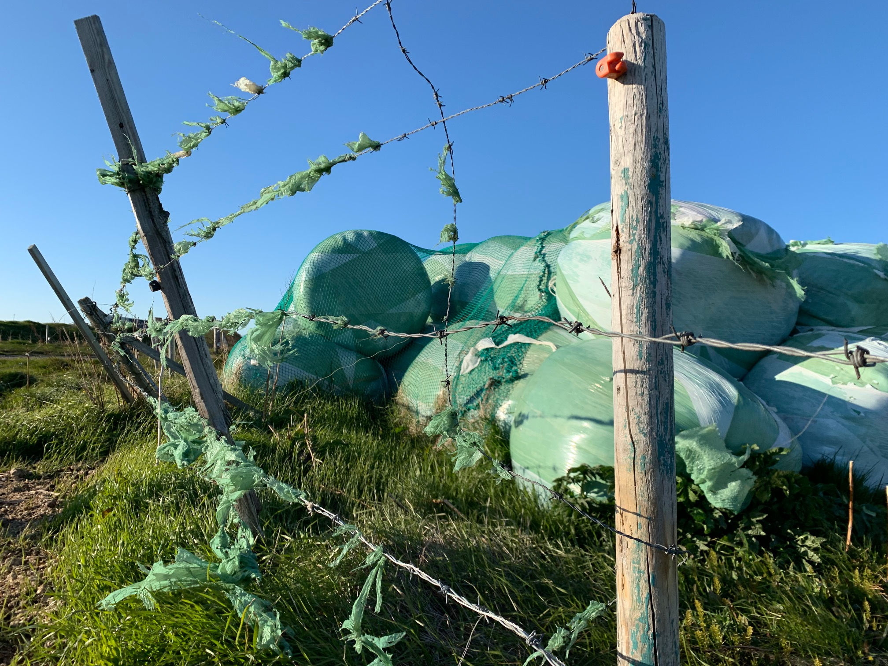
```
]

.pull-right[


+ 2.000 tonn innflutt á ári

+ 1.700 tonnum skilað í móttöku

+ 300 tonn:
    + urðun?
    + umhverfi?

]


---

class:middle
## Rusl í fjörum
.pull-left[
  ```{r ospartafla, echo=FALSE, message=FALSE, warning=FALSE, cache=TRUE,, dev.args=list(bg="transparent"), fig.cap='Rusl í fjörum á Íslandi. Unnið eftir gögnum frá OSPAR.'}
ospar <- read.csv("skjol/ospar.csv")
df <-
data.frame(
"Dags.(ár-mán-dag)" = as.Date(ospar[, 5], format = "%d/%m/%Y"),
Staður = ospar[, 2],
Plast =  rowSums(ospar[, substr(colnames(ospar), 1, 7) == "Plastic"]),
Gúmmí = rowSums(ospar[, substr(colnames(ospar), 1, 6) == "Rubber"]),
Textíll = rowSums(ospar[, substr(colnames(ospar), 1, 5) == "Cloth"]),
Pappír = rowSums(ospar[, substr(colnames(ospar), 1, 5) == "Paper"]),
Viður = rowSums(ospar[, substr(colnames(ospar), 1, 4) == "Wood"]),
Málmur = rowSums(ospar[, substr(colnames(ospar), 1, 5) == "Metal"]),
check.names = FALSE
)

# if (knitr::is_latex_output()) {
library(dplyr)
library(tidyr)

ldf <- df %>% gather(Efni, fjoldi, 3:8)
plot(factor(ldf$Efni), ldf$fjoldi,ylab="Fjöldi hluta")
#rass <- data.frame(ldf$`Dags.(ár-mán-dag)`,ldf$Efni,ldf$fjoldi)
#colSums(prop.table(t(matrix(rass$ldf.fjoldi,ncol = 18,byrow = T,dimnames = list(c(unique(rass$`Dags.(ár-mán-dag)`),as.character(unique(rass$ldf.Efni))))))))


# } else {
# library(DT)
# datatable(df[order(df[, 3], decreasing = T), ]) %>%
# formatStyle(
# names(df)[3:8],
# background = styleColorBar(range(df[, 3:8]), '#cb5600'),
# backgroundSize = '98% 88%',
# backgroundRepeat = 'no-repeat',
# backgroundPosition = 'center'
# )
#
# }


```
]

.pull-right[


+ 95% alls rusls plast

+ Gögn vantar

+ OSPAR skráir fjölda en ekki vigt


]

???
Orkumikil kerfi sem virka eins og myllur fyrir örplast

---

class:middle
## Gervigras
.pull-left[
  ```{r echo=FALSE, message=FALSE, warning=FALSE, out.width='100%'}
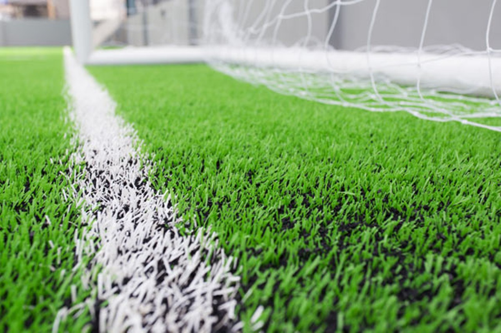
```
]

.pull-right[


+ Kurl (STB) <5mm

+ 140 tonn af kurli á velli í fullri stærð (12-13kg/m²)

+ 197 vellir hérlendis 
    + 7 keppnishús
    + 26 keppnisvellir
    + 12 æfingavellir og smærri hús
    + 111 sparkvellir KSÍ og 43 aðrir sparkvellir

+ 400.000 fermetrar
    + 13.000 m² með sandi
    + 387.000 m² með gúmmíi

]


---

```{r echo=FALSE, message=FALSE, warning=FALSE}
gervigras <- read.table("skjol/gervigras.csv",sep = ';',encoding = 'ISO 8859-1',header = T,dec = ',',stringsAsFactors = F)
gervigras$Ferm. <- as.numeric(gervigras$Ferm.)
gervigras$Gerð <- as.factor(gervigras$Gerð)
#motta <- gervigras[regexpr("motta",gervigras$Tegund.grass.og.fylliefnis)!=(-1),] #minnkar tap á kurli um 50%
#sand <- gervigras[regexpr("sand",gervigras$Tegund.grass.og.fylliefnis)!=(-1),]
gervigras$studull <- c()
gervigras[ rownames(gervigras[regexpr("motta",gervigras$Tegund.grass.og.fylliefnis)!=(-1),]),"studull"] <- "motta"
gervigras[ rownames(gervigras[regexpr("sand",gervigras$Tegund.grass.og.fylliefnis)!=(-1),]),"studull"] <- "sandur"

gervigras$kurl.lagt <- ifelse(is.na(gervigras$studull),gervigras$Ferm.*0.16,
                              ifelse(gervigras$studull=="motta",gervigras$Ferm.*0.16*0.5,0))
gervigras$kurl.hatt <- ifelse(is.na(gervigras$studull),gervigras$Ferm.*0.6,
                              ifelse(gervigras$studull=="motta",gervigras$Ferm.*0.6*0.5,0))
gervigras$slit.lagt <- gervigras$Ferm.*0.8*0.005
gervigras$slit.hatt <- gervigras$Ferm.*1.4*0.008

library(plyr)
fermetrar <- ddply(gervigras,.(Gerð),summarise,m2=mean(Ferm.),slit.lagt=mean(slit.lagt)*0.001,slit.hatt=mean(slit.hatt)*0.001,kurl.lagt=mean(kurl.lagt)*0.001,kurl.hatt=mean(kurl.hatt)*0.001)

# "Æfingavellir og smærri hús" "Keppnishús"
# "Keppnisvellir"              "Sparkvellir"
# "Sparkvellir (KSÍ)"
library(networkD3)
nodes <- c(as.character(fermetrar$Gerð),
           "Slit lægra mat",
           "Slit hærra mat",
           "Gúmmíkurl lægra mat",
           "Gúmmíkurl hærra mat")
nodes <- as.data.frame(nodes)
names(nodes) <- "name"
links <- data.frame(source=rep(c(0,1,2,3,4),each=4),target=rep(5:8,5),value=matrix(t(fermetrar[1:5,3:6])))
Sank <- list(nodes, links)
names(Sank) <- c('nodes', 'links')
sn <- sankeyNetwork(
  Links = Sank$links,
  Nodes = Sank$nodes,
  Source = "source",
  Target = "target",
  Value = "value",
  NodeID = "name",
  units = "tonn",
  colourScale = JS("d3.scaleOrdinal(d3.schemeCategory20);"),
  fontSize = 28,
  nodeWidth = 30, width = "500px", height = "500px", fontFamily = "Courier"
)
#sn
library(widgetframe)
rammi <- frameWidget(sn)
rammi
```

---

class:middle
## Snyrtivörur
.pull-left[
  ```{r echo=FALSE, message=FALSE, warning=FALSE, out.width='100%'}
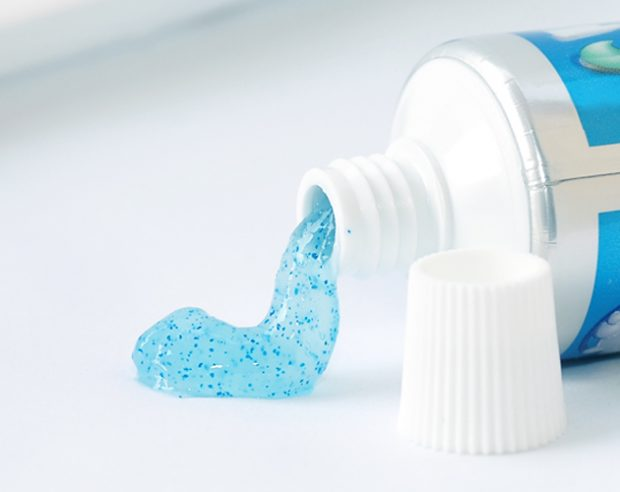
```
]

.pull-right[


+ undir 10 grömmum á mann á ári

+ Aðallega í handsápum sem eru ætlaðar til nota í iðnaði (t.d. á vélaverkstæðum)

.content-box-red[Áætluð heildarlosun örplasts í hafið frá snyrtivörum á Íslandi ≈ .bolder[0,34-3,4] tonn.

]]


???
file_name <- paste0("file://", normalizePath("slaedur.html"))
pagedown::chrome_print(file_name)
