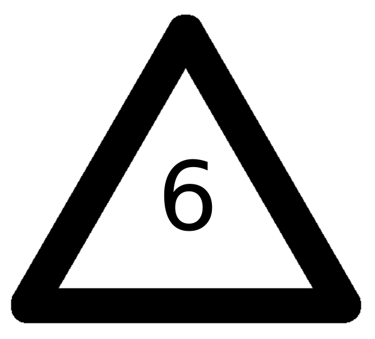
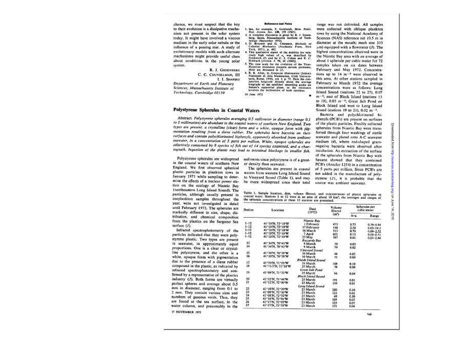
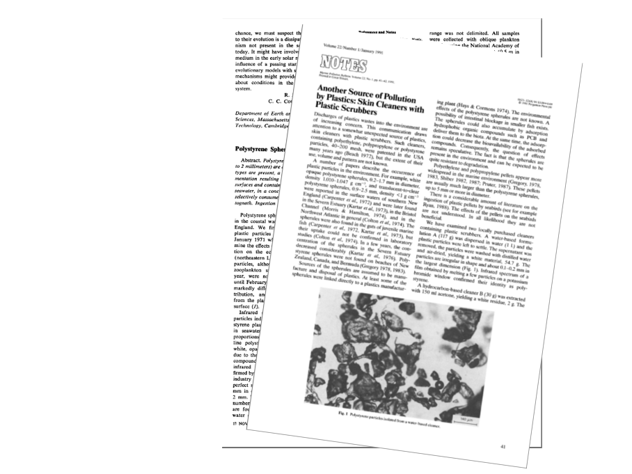
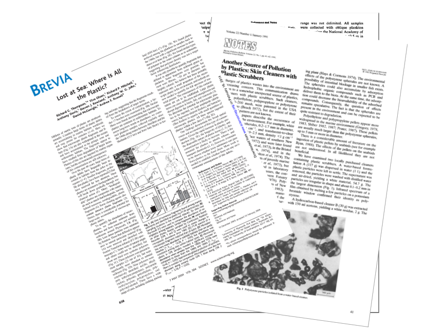

---
#Sys.setlocale("LC_TIME", "Icelandic")
title: "Örplast í hafinu við Ísland"
subtitle: "Helstu uppsprettur, magn og farvegir í umhverfinu"
author:   |
  <span class="noem">Valtýr Sigurðsson</span>
  <br><br>
  
  
date: "`r format(Sys.time(), '%e. %B %Y')`"
lang: is
output:
  xaringan::moon_reader:
    lib_dir: libs
    css: 
      - default
      - default-fonts
      - duke-blue
      - hygge-duke
      - libs/cc-fonts.css
      - libs/figure-captions.css
    nature:
      highlightStyle: github
      highlightLines: true
      countIncrementalSlides: false
---
class: center
# Hvað er plast?
```{r echo=FALSE, message=FALSE, warning=FALSE, out.width='90%'}
knitr::include_graphics("myndir/bakelite.png")
```
???
Plast er samofið öllum kimum samfélagsins. Það er órjúfanlegur þáttur í heilsukerfinu og það léttir faratæki í lofti, á landi og láði.
Spurning um að setja inn aðra svipaða slæðu með óþarfa plasti sem er til í svo miklu magni af því að það er svo ódýrt

Myndir:
málning: https://www.visindavefur.is/myndir/malning_380_120713.jpg
gervigras: https://media1.fdncms.com/pique/imager/u/zoom/3250826/news_whistler3-1-7285033a61845ebf.jpg
plastparket: https://www.recommend.my/blog/wp-content/uploads/2017/06/install-vinyl.jpg
Bárujárnsþak (ekki notað hér): https://www.visindavefur.is/myndir/barujarn_stor_180816.jpg
Þök í Rvk: https://scontent.frkv2-1.fna.fbcdn.net/v/t1.0-9/37335569_10156265971825042_1132775165936009216_n.jpg?_nc_cat=107&_nc_ht=scontent.frkv2-1.fna&oh=056dd75959e638b2da5c5f35b3dd7785&oe=5D691461
sjúkrahús: https://upload.wikimedia.org/wikipedia/commons/5/54/Dialysis_-_arm_-_01.jpg


---
class: center,middle
```{r framleidsla, echo=FALSE, message=FALSE, warning=FALSE,, out.width='80%'}
library(kableExtra)
haus <- c('Plastgerð','Skammstöfun (ensk)','Heimsframleiðsla', 'Plastkóði (RIC)')#,'Einliða resíns')

type = c(
  'Pólýetýlen terefþalat',
  'Pólýetýlen - eðlisþyngd > 0,94 g/cm^3^',
  'Pólývínyl klóríð',
  'Pólýetýlen - eðlisþyngd < 0,94 g/cm^3^',
  'Pólýprópýlen',
  'Pólýstýren',
  'Annað'
)

type.pdf = c(
  'Pólýetýlen terefþalat',
  'Pólýetýlen - há eðlisþyngd',
  'Pólývínyl klóríð',
  'Pólýetýlen - lág eðlisþyngd',
  'Pólýprópýlen',
  'Pólýstýren',
  'Annað'
)

abbro= c(
  'PET, PETE',
  'HD-PE, PE-HD',
  'PVC',
  'LDPE, PE-LD',
  'PP',
  'PS',
  ''
)

total=c(
  '7%',
  '15%',
  '16%',
  '17%',
  '23%',
  '7%',
  '15%'
)
# icon=c(icon1="",
#        icon2="",
#        icon3="",
#        icon4="",
#        icon5="",
#        icon6="",
#        icon7="")


icon=c(icon1='</img>',
       icon2='</img>',
       icon3='</img>',
       icon4='</img>',
       icon5='</img>',
       icon6='</img>',
       icon7='</img>')

tafla = cbind(type.pdf, abbro, total, icon)
dimnames(tafla)[2] <- list(haus)
rownames(tafla) <- NULL
tafla <- as.data.frame(tafla)

#DT::datatable(tafla, escape = FALSE)
 
 knitr::kable(
   tafla,
   align = 'c',
   booktabs = T,
   escape = F,
   caption = 'Alþjóðlegt flokkunarkerfi (RIC) fyrir algengustu plastefnin.',
   "html"
   )# eru númeraðar eftir alþjóðlegu flokkunarkerfi (RIC). Skammstafanirnar eru fyrir ensku heitin: (1) Polyethylene Terephthalate - PETE/PET, (2) High Density Polyethylene - HDPE/HD-PE, (3) Polyvinyl Chloride - PVC/V, (4) Low Density Polyethylene - LDPE/LD-PE, (5) Polypropylene - PP, (6) Polystyrene - PS')
  
```

???
Algengustu plastefnin eru flokkuð í 6 algengustu gerðir plasts en allt annað plast lendir í 7 flokknum. Í þeim flokki eru allskonar samsett plast líkt og notað er í báta, filmur, lakk og pólýúretön, blöðrur og hjólbarðar.

---

class: center
# Hvað er plast?
.pull-left[
```{r echo=FALSE, message=FALSE, warning=FALSE, out.width='100%'}
knitr::include_graphics("myndir/Polystyrene.png")
```
<br>
<br>

]
.pull-right[
```{r echo=FALSE, message=FALSE, warning=FALSE, out.width='100%'}
knitr::include_graphics("https://thumbs.gfycat.com/OldfashionedHarshBettong-size_restricted.gif")
```
]

Pólýstýren er myndað með fjölliðun á stýreni.

???
https://www.youtube.com/watch?v=BCNWav12PdI

---
class: center, inverse
# Hvað er plast?
## Myndun fyrsta plastefnisins „Bakelite“
```{r echo=FALSE, message=FALSE, warning=FALSE, out.width='100%'}
knitr::include_graphics("https://thumbs.gfycat.com/BaggyWarlikeAmericancrow-size_restricted.gif")
```


???
Fyrsta plastefnið, Bakelite, var fundið upp um aldamótin 1900
Fenól og formaldehýð hitað og hrært saman við brennisteinssýru til að mynda fenólformaldehýðresín sem er fyrsta plastefnið eða plastresínið.

---

class:center, middle, inverse
.Large[Fyrsta tilkynning um örplast 1972]
```{r echo=FALSE, message=FALSE, warning=FALSE, out.width='100%'}

```

---

class:center, middle, inverse
.Large[Örplast í snyrtivörum 1991]
```{r echo=FALSE, message=FALSE, warning=FALSE, out.width='100%'}

```

---

class:center, middle, inverse
.Large[Hugtakið „microplastic“ sett fram 2004]
```{r echo=FALSE, message=FALSE, warning=FALSE, out.width='100%'}

```

???
Árið 1972 (Carpender ofl.) var tilkynnt um pólýstýren í hafi sem hefðu bakteríur á yfirborði sínu. Áður hafði fólk lengi tekið eftir því hve plast var slitþolið og entist lengi í umhverfinu og að það fyndist í maga fugla og annarra dýra.
Árið 1991 kom út grein (eftir V. Zitko) þar sem bent var á að í snyrtivörum væru smáar plastagnir sem bærust í hafið
Árið 2004 var hugtakið „microplastic“ sett fram (Thompson) í grein þar sem sýni úr sjávarseti voru skoðuð með litrófssjá og um 9 gerðir plasts fundust í þeim þ.á.m. úr fatnaði, pakkningum, reipum o.fl. Einnig voru þörungasýni greind aftur í tímann til 1960 og sást þá skýrt að eftir því sem framleiðsla á plasti eykst fjölgar plastögnum í hafinu.

---

```{r pubtrend, echo=FALSE, message=FALSE, warning=FALSE, dev.args=list(bg="transparent"), out.width='60%', fig.align='center'}

par(mar=c(4,4,4,2))

roundUpNice <- function(x, nice=c(1,2,4,5,6,8,10)) {
  if(length(x) != 1) stop("'x' must be of length 1")
  10^floor(log10(x)) * nice[[which(x <= 10^floor(log10(x)) * nice)[[1]]]]
} # https://stackoverflow.com/questions/6461209/how-to-round-up-to-the-nearest-10-or-100-or-x

pub.trend <- read.csv("skjol/PubTrend.txt",sep = "\t")
pub.trend <- pub.trend[,1:2]
pub.trend <- pub.trend[rev(rownames(pub.trend)),]
maxtala <- max(pub.trend[,2])
require(RColorBrewer)
litir <- colorRampPalette(c('#d75f07','seashell','#069acc'))(dim(pub.trend)[1])
litir <- rev(litir)
bp <- barplot(pub.trend[,2],ylab='',xlab='',axes=F,beside=TRUE,ylim=c(0,maxtala*1.1))
abline(h=seq(0,roundUpNice(1.1*maxtala),roundUpNice(1.1*maxtala)/5), col = 'lightgray', lty = 3)
barplot(pub.trend[,2], main='Fjöldi ritrýndra greina um örplast á ári', ylab="Fjöldi greina", beside=TRUE, axes = F, col=litir ,ylim = c(0,maxtala*1.1),add=T);box()
axis(2,seq(0,roundUpNice(1.1*maxtala),roundUpNice(1.1*maxtala)/5),labels = seq(0,roundUpNice(1.1*maxtala),roundUpNice(1.1*maxtala)/5),las=2)
axis(1,bp,pub.trend[,1])
```

.large[
Birtingar alþjóðlegra vísindagreina með örplast sem meginviðfangsefni á árunum 2008 til 2018. Fengið af vef [Web of Knowledge](https://webofknowledge.com).
]
---

background-image: url(myndir/samsett.png)
background-size: contain
background-position: right

class: left, middle

###Hvað er örplast og <br>
###Hvaðan kemur það?


???
Örplast kemur aðallega frá stærra plasti sem veðrast og slitnar við notkun.
Dekk, vegmerkingar, hráplast (e. nurdles),örplast í sýni frá BioPol, reipi, íslensk framleiðsla á kari úr plasti, syntetískur fatnaður, plastpokar, snyrtivörur.

http://mediad.publicbroadcasting.net/p/wemu/files/201602/old_tires.jpg
https://i.ytimg.com/vi/gdZYkOFiROI/maxresdefault.jpg
https://keyassets-p2.timeincuk.net/wp/prod/wp-content/uploads/sites/57/2016/08/microbeads-landscape-620x492.jpg
http://my.essai-tools.com/uploads/20189174/car-plastic-parts-molding32583594420.jpg
https://za.toluna.com/dpolls_images/2018/09/20/34ca78d1-75be-4436-a5ae-4be1bccc2b78.jpg
http://www.svn.is/images/Gullverskar_%C3%A1_v%C3%AD%C3%B0avangi.jpg
https://biopol.is/files/frettamyndir/karin_microplast_fiskifr.jpg
https://upload.wikimedia.org/wikipedia/commons/f/f3/Plastic_pellets.jpg
http://www.keycolour.net/wp-content/uploads/2017/08/fabric-624x468.jpg
https://cdn.textileschool.com/wp-content/uploads/2011/02/rope-1457381_1280.jpg
---

background-image: url(myndir/bakgrunnur.png)
class:middle
#Skilgreining örplasts
.content-box-red[.justify-center[
Plastagnir sem eru minni en **5 mm** í tveimur víddum <br> (lengd, hæð eða breidd)
]]
--
.pull-left[

### Frummyndað
.blue[Frummyndað örplast (*e. primary*)<br>
Berst út í umhverfið sem örplast
  - Affall úr skólpi og ræsum
  - Óhöpp við flutninga

]]

.pull-right[
### Síðmyndað

.orange[Síðmyndað örplast (*e.secondary*) <br>
Verður til við sundrun plasts í náttúrunni
  - Plastrusl í fjörum
  - Annað rusl

]]

???


---
```{r setup, include=FALSE}
options(htmltools.dir.version = FALSE)
```

```{r Sank, echo=FALSE, message=FALSE, warning=FALSE}
#, fig.cap='Helstu uppsprettur örplasts á Íslandi og hlutfallsleg skipting þeirra eftir því hvort afdrif þess eru í haf eða í jarðveg.'}

# libs <- c("rgdal", "maptools", "gridExtra","tmap","tmaptools","sp")
# lapply(libs, require, character.only = TRUE)
# 
# malbik <- rgdal::readOGR("C:/Users/BioPol VS/Documents/Vinnumappa/GIS/IS50V_SAMGONGUR_17062016_ISN2004/IS50V_SAMGONGUR_SHP/vegir1og5.shp",require_geomType = "wkbLineString")
# byggd <- rgdal::readOGR("C:/Users/BioPol VS/Documents/Vinnumappa/GIS/IS50V_MANNVIRKI_17062016_ISN2004/IS50V_MANNVIRKI_SHP/is50v_mannvirki_flakar_17062016.shp")
# clp1 <- raster::intersect(malbik,byggd)
# sum(as.numeric(as.character(clp1@data$lengd)))/sum(as.numeric(as.character(malbik@data$lengd))) #Hlutfall lengdar malbiks innan þéttbýlis = 36%

Magn = c(379,586,38,233,21,48,3,11,8,32,6,60,0.3,3)
l <- c((0.74)*Magn[1]*0.6+(1-0.74)*Magn[1]*0.1, # Dekkjaslit, lægra mat út frá því hve mikið fer í jarðveg eða ræsi [@Verschoor2016] 3/4 umferðar hið minnsta er í þéttbýli
       (0.34)*Magn[3]*0.6+(1-0.34)*Magn[3]*0.1, # Vegmerkingar, lægra mat út frá því hve mikið fer í jarðveg eða ræsi [@Verschoor2016] 36% malbiks (hið minnsta) er í þéttbýli (út frá IS50V)
       (0.69)*Magn[5]*0.6+(1-0.69)*Magn[5]*0.1, # Málning, hlutfall sem fer í ræsi og jarðveg byggt á sömu forsendum og dekkjaslit og vegmerkingar (skipti ekki í inni- og útimálningu)
       Magn[7]*0.6, # Gervigras er allt í þéttbýli og því er reiknað með að um 60% endi í ræsum
       Magn[9], # Þvottur fer beint í hafið
       Magn[13]) # Snyrtivörur fara beint í hafið

h <- c((0.74)*Magn[2]*0.6+(1-0.74)*Magn[2]*0.1, # Dekkjaslit, lægra mat út frá því hve mikið fer í jarðveg eða ræsi [@Verschoor2016] 3/4 umferðar hið minnsta er í þéttbýli
       (0.34)*Magn[4]*0.6+(1-0.34)*Magn[4]*0.1, # Vegmerkingar, lægra mat út frá því hve mikið fer í jarðveg eða ræsi [@Verschoor2016] 36% malbiks (hið minnsta) er í þéttbýli (út frá IS50V)
       (0.69)*Magn[6]*0.6+(1-0.69)*Magn[6]*0.1, # Málning, hlutfall sem fer í ræsi og jarðveg byggt á sömu forsendum og dekkjaslit og vegmerkingar (skipti ekki í inni- og útimálningu)
       Magn[8]*0.6, # Gervigras er allt í þéttbýli og því er reiknað með að um 60% endi í ræsum
       Magn[10], # Þvottur fer beint í hafið
       Magn[14]) # Snyrtivörur fara beint í hafið

losun <- (l+h)/2 #Meðaltal lægra og hærra mats á losun.
value <- c(379,586,38,233,21,48,3,11,8,32,0.3,3)
heiti <-rep(c('Dekkjaslit','Vegmerkingar','Málning','Gervigras','Þvottur','Snyrtivörur'),each=2)
df <- data.frame(value,heiti)
df$losun <- rep(losun,each=2)
library(plyr)
df <- ddply(df,('heiti'),summarise,heild=mean(value),losun=mean(losun))
df$land <- df$heild-df$losun
#DF <- data.frame(heiti=rep(df$heiti,2),losun=c(df$land,df$losun),vdtk=rep(c('land','sjor'),each=6))
library(networkD3)
nodes <-
  c('Dekkjaslit ','Vegmerkingar ','Málning ','Gervigras ','Þvottur ','Snyrtivörur ')
nodes <- as.data.frame(c(nodes[order(nodes)], 'Land ','Haf '))
names(nodes) <- "name"
#nodes$name <-  as.character(nodes$name)
value <- rbind(matrix(c(df[1,c(3,4)])),matrix(c(df[2,c(3,4)])),matrix(c(df[3,c(3,4)])),matrix(c(df[4,c(3,4)])),matrix(c(df[5,c(3,4)])),matrix(c(df[6,c(3,4)])))
links <- 
  data.frame(
    source=c(0,0,1,1,2,2,3,4,5,5),
    target=c(7,6,7,6,7,6,7,7,7,6),
    value=unlist(value[-c(8,10)])
  )


Sank <- list(nodes, links)
names(Sank) <- c('nodes', 'links')
sankeyNetwork(
  Links = Sank$links,
  Nodes = Sank$nodes,
  Source = "source",
  Target = "target",
  Value = "value",
  NodeID = "name",
  units = "tonn",
  colourScale = JS("d3.scaleOrdinal(d3.schemeCategory20);"),
  fontSize = 26,
  nodeWidth = 30,
  width = 800,
  height = 600
)


```

???

Stærsta uppspretta örplasts í umhverfinu á Íslandi, sem lagt var mat á, er tengd bifreiðaumferð. Slit á dekkjum og vegmerkingum er um 60-85% örplastslosunar á Íslandi
---


class: middle

# NOTE

Many of the *cheat sheet* examples are displayed in the slide itself.  Some of the example code will be found in the presenter notes.  

Access **presenter notes** by pressing the keyboard shortcut .red[**`p`**].  (Or, `?` for other shortcuts)

Full detailed R Markdown can always be displayed by opening the rendered HTML slides in your **web browser via `View Source`**.  

---
## CSS styles 

The CSS style used in this example are

- xaringan default  ([`default`](https://github.com/yihui/xaringan/blob/master/inst/rmarkdown/templates/xaringan/resources/default.css))
- xaringan default font ([`default-fonts`](https://github.com/yihui/xaringan/blob/master/inst/rmarkdown/templates/xaringan/resources/default-fonts.css))
- [Duke Unversity color palette](https://styleguide.duke.edu/color-palette/) ([`duke-blue`](https://github.com/yihui/xaringan/blob/master/inst/rmarkdown/templates/xaringan/resources/duke-blue.css))
- Duke color palette overlaid on [Hygge CSS](http://biostatistics.dk/presentations/xaringan/ghoul.html), ([`hygge-duke`](https://github.com/yihui/xaringan/blob/master/inst/rmarkdown/templates/xaringan/resources/hygge-duke.css))
- [Creative Commons](https://creativecommons.org/) licensing [fonts](https://stackoverflow.com/a/5215916) (CC BY-NC, etc.) (`cc-fonts.css`)
- figure captions (`figures.css`)

You can find these style sheets declared in the `yaml` header inside the R Markdown file.

---
background-image: url(https://upload.wikimedia.org/wikipedia/commons/thumb/e/e6/Duke_University_logo.svg/640px-Duke_University_logo.svg.png)

``` css
# Display background image with background-image: url()
#
background-image: url(https://upload.wikimedia.org/wikipedia/commons/thumb/e/e6/Duke_University_logo.svg/640px-Duke_University_logo.svg.png)
```


???

Image credit: [Wikimedia Commons](https://commons.wikimedia.org/wiki/File:Duke_University_logo.svg)

---
class: inverse, center, middle

# Get Started

.justify-left[
``` r
---
class: inverse, center, middle

# Get Started
```
]

---

# Hello World

Install the **dukeslides**<sup>1</sup> package from [Github](https://github.com/libjohn/dukeslides)

```{r eval=FALSE, tidy=FALSE}
# monospace font is displayed when code is written 
# inside of an Rmarkdown code chunk
devtools::install_github("libjohn/dukeslides")
```

.content-box-grey[
- **Create a new R Markdown document** from the menu `File -> New File -> R Markdown -> From Template -> Slide template for Duke University`
]

.content-box-grey[
- Click the **`Knit`** button **to compile** the slide into rendered HTML]

.footnote[
[1] [dukeslides](https://github.com/libjohn/dukeslides/) is a [Duke University branded](https://styleguide.duke.edu/color-palette/) version of [xaringan presentation slides](https://slides.yihui.name/xaringan/).
]

---
# Making Bullets

- List items (bullets) are invoked with a leading, left-justified dash, just like any Rmarkdown<sup>1</sup> document

``` r
- List items (bullets) are invoked with a leading,
left-justified dash, just like any 
Rmarkdown<sup>1</sup> document
```
.footnote[
[1] [Getting Started with R Markdown](https://rmarkdown.rstudio.com/lesson-1.html)
]

--

``` r
--
```

- Two left-justified dashes creates a pause to reveal the slide in increments.  `arrow` keys and number keys advance from slide to slide. [See more documentation on incrementing](https://slides.yihui.name/xaringan/incremental.html#11)

---
# Knit

As previously mentioned, 

.content-box-grey[
- Click the **`Knit`** button **to compile** the slide into rendered HTML
]

Or, use the [RStudio Addin](https://rstudio.github.io/rstudioaddins/) "Infinite Moon Reader" to live preview the slides (every time you update and save the Rmd document, the slides will be automatically reloaded in RStudio Viewer.


---
background-image: url(https://c2.staticflickr.com/6/5729/30943501632_eb0b200eed_b.jpg)
class: center, top

# Rock Cairn Hiking

.justify-left[
``` r
---
background-image: url(https://c2.staticflickr.com/6/5729/30943501632_eb0b200eed_b.jpg)
class: center, top

# Rock Cairn Hiking

.footer-note[.tiny[.green[Image Credit: ][Brandon Rasmussen](https://www.flickr.com/photos/137029081@N02/30943501632/in/photostream/)]]

```
]


.footer-note[.tiny[.green[Image Credit: ][Brandon Rasmussen](https://www.flickr.com/photos/137029081@N02/30943501632/in/photostream/)]]

???

``` r
---
background-image: url(https://c2.staticflickr.com/6/5729/30943501632_eb0b200eed_b.jpg)
class: center, top, inverse

# Rock Cairn Hiking


.footer-note[.tiny[.green[Image Credit: ][Brandon Rasmussen](https://www.flickr.com/photos/137029081@N02/30943501632/in/photostream/)]]
```

---
## Two Column

.pull-left[
- You can generate a left column 

- by wrapping the left-hand text in `.pull-left[` foo `]`

- TAGS <sup>1</sup>

- Splunk
]

.pull-right[
- You can generate a right column 

- by wrapping the right-hand text in `.pull-right[` foo `]`

- foo

- foo <sup>2</sup>
]


``` r
# superscript is wrapped in HTML
TAGS <sup>1</sup>

```


.footnote[
[1] example foonote 1  -- footnote text wrapped in `.footnote[foo]`

[2] example footnote 2 
]

---
class: inverse

## inverse

### h3

Lorem Ipsum

"Neque porro quisquam est qui dolorem ipsum quia dolor sit amet, consectetur, adipisci velit..."

``` r
---
class: inverse

## inverse

### h3

Lorem Ipsum

"Neque porro quisquam est qui dolorem ipsum quia dolor sit amet, consectetur, adipisci velit..."
```


---
class: duke-softblue

## duke-softblue

``` r
---
class: duke-softblue
```

Lorem Ipsum

"Neque porro quisquam est qui dolorem ipsum quia dolor sit amet, consectetur, adipisci velit..."

- one

- [Google](http://google.com)

- three

---
class: duke-orange

## duke-orange

``` r
---
class: duke-orange
```

Lorem Ipsum

"Neque porro quisquam est qui dolorem ipsum quia dolor sit amet, consectetur, adipisci velit..."

- one

- [Google](http://google.com)

- three

---
class: duke-green

## duke-green

``` r
---
class: duke-green
```

"Neque porro quisquam est qui dolorem ipsum quia dolor sit amet, consectetur, adipisci velit..."

- one

- [Green website inspirations](https://webdesignledger.com/50-green-web-designs-to-inspire-you/)

- three

---
background-image: url(http://www.publicdomainpictures.net/pictures/170000/velka/hand-holding-old-keys-1462981136Ul1.jpg)
background-size: contain

## hygge-duke Two Column

.content-box-grey[ qui dolorem ipsum quia dolor sit amet, consectetur, adipisci velit... ]


.pull-left[
&nbsp;

&nbsp;

&nbsp; 

``` r
.pull-left[ 
   nabisco crackers 
   snackum attackum ...
   ]
```
]

&nbsp; 

.pull-right[.full-width[.rotate-left[.content-box-blue[

- Wrap the right-hand text in \.pull-right\[ \.content-box-blue\]

&nbsp; 

&nbsp; 

&nbsp;


``` r
.pull-right[.full-width[
  .rotate-left[
    .content-box-blue[snackum 
      nabiskum]
]]]
```

]]]]

<!-- Image credit:  http://www.publicdomainpictures.net/view-image.php?image=167489  -->

&nbsp; 

.footnote[.scriptsize[
- `background-size: contain`
- `View Source` to see all of the R Markdown for this slide
]]

???

Image credit:  http://www.publicdomainpictures.net/view-image.php?image=167489

---

# Modifying text

.pull-left[

## Font sizes

This is normal size ( $\LaTeX$-friendly terms)

.Large[Large]

.large[large]

.small[small]

.footnotesize[footnotesize]

.scriptsize[scriptsize]

.tiny[tiny]

]

.pull-right[

## Text color

.black[black]

.red[red]

.blue[blue]

.green[green], 
.yellow[yellow], 
.orange[orange], 
.purple[purple], 
.gray[gray or grey]

You can also use `.bold[]` or `.bolder[]` to emphasize text 

This is .bold[bold], this is .bolder[bolder] and this is regular markdown **double-star bold** (visible differences depend on the font)

]

.content-box-green[.scriptsize[.justify-center[
[Hegge CSS](http://biostatistics.dk/presentations/xaringan/ghoul.html) + [Duke Color Palette](https://styleguide.duke.edu/color-palette/) = hegge-duke.css]
]]]

---

## Coloured content boxes

Use `.content-box-blue` (or gray/grey, duke-green, green, purple, red, or yellow) to produce a box with coloured background. Size depends on content.

`.content-box-blue[I feel blue]` yields

.content-box-blue[I feel blue]

Wrap in `.full-width` to expand the width

.full-width[.content-box-red[I feel wide and red]]

If you have content in columns then you get

.pull-left[.full-width[.content-box-yellow[**WARNING** Look out for minons or bananas]]]
.pull-right[.full-width[.content-box-yellow[The box to the left was created using `.pull-left[.full-width[.content-box-yellow[]]]`]]]


---

## Coloured content boxes

Use `.content-box-blue` to produce a box with blue background. Size depends on content.  color has the following options:  `.content-box-color` where color is   blue | gray | grey | neutral | duke-green | green | purple | red | yellow

&nbsp;

.content-box-blue[blue]
.content-box-gray[gray]
.content-box-grey[grey]
.content-box-neutral[neutral]

&nbsp;

.content-box-duke-green[duke-green]
.content-box-green[green]
.content-box-purple[purple]

&nbsp; 

.content-box-red[red]
.content-box-yellow[yellow]


---

# CSS

CSS is the key to managing the style of your slides.  The cascading style sheets (CSS) are declared in the yaml header.

```yaml
output:
  xaringan::moon_reader:
    css: ["default", "ubuntu-mono.css"]
```

.footnote[.content-box-green[- Slide #4 documents the styles used in this presentation
- The next slide provides some information on customizing or accessing available themes]
]
---

# CSS User-Contributed Themes

User-contributed themes. A theme typically consists of two CSS files `foo.css` and `foo-fonts.css`, where `foo` is the theme name. Below are some existing themes:

```{r}
names(xaringan:::list_css())
```

To use a theme, you can specify the `css` option as an array of CSS filenames (without the `.css` extensions), e.g.,

```yaml
output:
  xaringan::moon_reader:
    css: [default, metropolis, metropolis-fonts]
```

If you want to contribute a theme to **xaringan**, please read [this blog post](https://yihui.name/en/2017/10/xaringan-themes).

---
class: duke-orange
# Figure Captions

<figure>
  
    <figcaption> Image Credit:  
      <a href="https://www.flickr.com/photos/wordridden/4735322270/in/photolist-8drLkq-646eKc-nG7uhG-quFpgc-4ucjnx-fe82eN-dYBniL-dYvFA4-9Cf4eR-6EGeNs-6HTKQj-65AZMK-fWBnJR-7xRE6a-6hXAvM-piV5xr-89EMot-6Ea5Ks-dPGTJM-dxKznu-6PLmRW-3YRkU8-5iq1tD-fmHnyr-iiLdJL-e5r9bR-5fAPht-8arifu-oBFJHP-fHytwE-7m3YaS-vKsn9-cMyqho-cNg979-gMG6Ng-6ox1FA-2MHsz8-c9LomS-bq7wvo-nt5ipG-rZ5GFD-duEHPx-pgTp2N-8mzmRJ-67XBkZ-ewrn88-b39pr2-6vRoKp-6mZfyi-6DxVuk">Salad Onions</a> by Jessica Spengler 
    </figcaption>
</figure>

.justify-left[
``` html
<figure>
  
    <figcaption> Image Credit: foo text here </figcaption>
</figure>

# Must declare figure-captions in the YAML header
# Must use HTML instead of RMarkdown

```
]

---
exclude: false
class: center, middle
background-image: url(https://blogs.library.duke.edu/magazine/files/2010/12/duke-university-libraries-logo.jpg)
<!-- https://commons.wikimedia.org/wiki/File:Duke_University_logo.svg -->
<!-- https://blogs.library.duke.edu/magazine/files/2010/12/duke-university-libraries-logo.jpg -->
<!-- http://library.duke.edu/data/sites/default/files/datagis/images/data_gis_logo.png -->

<!-- HTML comment can go here  -->
  
???

Presenter Notes go here
use 'p' to toggle the presenter mode or '?' or 'h' to toggle the help / key-shortcut options

Image credit: [Wikimedia Commons](https://commons.wikimedia.org/wiki/File:Duke_University_logo.svg)


---
class: inverse, middle, center

# More xaringan Documentation

---

# xaringan

Provides an R Markdown output format `xaringan::moon_reader` as a wrapper for remark.js, and you can use it in the YAML metadata, e.g.

```yaml
---
title: "A Cool Presentation"
output:
  xaringan::moon_reader
    yolo: true
    nature:
      autoplay: 30000
---
```

See the help page `?xaringan::moon_reader` for all possible options that you can use.

---

# using **xaringan** 

.pull-right[
1. Start with an R Markdown document;

1. R Markdown (can embed R/other code chunks);

1. Provide an option `autoplay`;

1. MathJax just works;<sup>*</sup>

1. Highlight code with `{{}}`;

1. The RStudio addin "Infinite Moon Reader" automatically refreshes slides on changes;
]

.footnote[[*] Not really. See next page.]

---

# Math Expressions

You can write LaTeX math expressions inside a pair of dollar signs, e.g. &#36;\alpha+\beta$ renders $\alpha+\beta$. You can use the display style with double dollar signs:

```
$$\bar{X}=\frac{1}{n}\sum_{i=1}^nX_i$$
```

$$\bar{X}=\frac{1}{n}\sum_{i=1}^nX_i$$

Limitations:

1. The source code of a LaTeX math expression must be in one line, unless it is inside a pair of double dollar signs, in which case the starting `$$` must appear in the very beginning of a line, followed immediately by a non-space character, and the ending `$$` must be at the end of a line, led by a non-space character;

1. There should not be spaces after the opening `$` or before the closing `$`.

1. Math does not work on the title slide (see [#61](https://github.com/yihui/xaringan/issues/61) for a workaround).

---

# R Plots

```{r include=FALSE}
fit = lm(dist ~ 1 + speed, data = cars)
coef(summary(fit))
dojutsu = c('地爆天星', '天照', '加具土命', '神威', '須佐能乎', '無限月読')
grep('天', dojutsu, value = TRUE)
```


```{r cars, fig.height=4, dev='svg'}
# visualizations are cool, duh.

par(mar = c(4, 4, 1, .1))
plot(cars, pch = 19, col = 'darkgray', las = 1)
abline(fit, lwd = 2)
```


---

# Tables

If you want to generate a table, make sure it is in the HTML format (instead of Markdown or other formats), e.g.,

```{r}
knitr::kable(head(iris), format = 'html')
```

---
### more HTML (kable) table
```{r include=FALSE}
library(magrittr)
library(kableExtra)
```

```{r include=FALSE}
text_tbl <- data.frame(
  Items = c("Item 1", "Item 2", "Item 3"),
  Features = c(
    "Lorem ipsum dolor sit amet, consectetur adipiscing elit. Proin vehicula tempor ex. Morbi malesuada sagittis turpis, at venenatis nisl luctus a. ",
    "In eu urna at magna luctus rhoncus quis in nisl. Fusce in velit varius, posuere risus et, cursus augue. Duis eleifend aliquam ante, a aliquet ex tincidunt in. ", 
    "Vivamus venenatis egestas eros ut tempus. Vivamus id est nisi. Aliquam molestie erat et sollicitudin venenatis. In ac lacus at velit scelerisque mattis. "
  )
)
```
```{r echo=FALSE}
kable(text_tbl, "html") %>%
  kable_styling(full_width = F, bootstrap_options = c("striped", "hover")) %>%
  column_spec(1, bold = T, border_right = T) %>%
  column_spec(2, width = "30em", background = "yellow") %>% 
  row_spec(3, bold = T, color = "white", background = "#D7261E") %>% 
  column_spec(1, background = "white", color = "black")
```

### Kable HTML Documentation

[Documentation](https://cran.r-project.org/web/packages/kableExtra/vignettes/awesome_table_in_html.html) for HTML (kable) tables via the `library(kableExtra)` package


---

# HTML Widgets


```{r out.width='100%', fig.height=6, eval=require('leaflet')}
library(leaflet)
leaflet() %>% addTiles() %>% setView(-93.65, 42.0285, zoom = 17)
```

---

```{r eval=require('DT'), tidy=FALSE}
DT::datatable(
  head(iris, 10),
  fillContainer = FALSE, options = list(pageLength = 8)
)
```

---

# Highlight Code

- The option `highlightLines: true` of `nature` will highlight code lines that start with `*`, or are wrapped in `{{ }}`, or have trailing comments `#<<`;

```yaml
output:
  xaringan::moon_reader:
    nature:
      highlightLines: true
```


See examples on the next page.

---

# Highlight Code with * or `{{}}`


.pull-left[
An example using a leading `*`:

```r
if (TRUE) {
** message("Very important!")
}
```
Output:
```r
if (TRUE) {
* message("Very important!")
}
```

This is invalid R code, so it is a plain fenced code block that is not executed.
]

.pull-right[
An example using `{{}}`:

`r ''````{r tidy=FALSE}
if (TRUE) {
*{{ message("Very important!") }}
}
```

Output:
```{r tidy=FALSE}
if (TRUE) {
{{ message("Very important!") }}
}
```

It is valid R code so you can run it. Note that `{{}}` can wrap an R expression of multiple lines.
]

---

# Highlight with trailing `#<<`

An example of using the trailing comment `#<<` to highlight lines:

``` r
library(ggplot2)
ggplot(mtcars) + 
  aes(mpg, disp) + 
  geom_point() +   #<<
  geom_smooth()    #<<
```


Output:

```{r tidy=FALSE, eval=FALSE}
library(ggplot2)
ggplot(mtcars) + 
  aes(mpg, disp) + 
  geom_point() +   #<<
  geom_smooth()    #<<
```

---

# Selected xaringan documentation links

1. [xaringan documentation](https://slides.yihui.name/xaringan/)

    - [xarigan wiki](https://github.com/yihui/xaringan/wiki)

1. [hegge CSS](http://biostatistics.dk/presentations/xaringan/ghoul.html)

1. [incrementing slides, layouts, template, place holders](https://slides.yihui.name/xaringan/incremental.html)

1. [remark.js documentation](https://remarkjs.com) library;


---

# John Little

&nbsp;

.pull-left[.full-width[.content-box-green[
### Data Analytics Librarian

- https://johnlittle.info/

- https://github.com/libjohn
]]

### Rfun host...
You can make **Rfun** with our resources for R and data science analytics.  See the [R we having fun yet‽](https://rfun.library.duke.edu/) resource pages.
]

.pull-right[.content-box-grey[
### Duke University

**Data & Visualization Services**

- https://library.duke.edu/data/
- askData@Duke.edu
- The /Edge, Bostock (1st Floor)
- [Past Workshops](https://library.duke.edu/data/news/past-workshops)
- [Guides & Tutorials](https://library.duke.edu/data/tutorials)

]]


---
class: center, middle
## Shareable 

Data, presentation, and handouts 

<span class="cc">
<!-- Key: a: SA, b: BY, c: CC Circle, d: ND, n: NC, m: Sampling, s: Share, r: Remix, C: CC Full Logo -->
C bn
</span>


[CC BY-NC license](https://creativecommons.org/licenses/by-nc/4.0/)


